# 第1章 Android基础入门

## 1.2 搭建Android开发环境

**特定 Android API 级别所要求的最低工具版本：**

| API级别          | 最低Android Studio版本                | 相关链接                                                     |
| ---------------- | ------------------------------------- | ------------------------------------------------------------ |
| 34（Android 14） | Android Studio Flamingo \| 2022.2.1   | [link](https://developer.android.google.cn/about/versions/14/setup-sdk?hl=en#get-studio) |
| 33（Android 13） | Android Studio Chipmunk \| 2021.2.1   | [link](https://developer.android.google.cn/about/versions/13/setup-sdk?hl=zh-cn#get-studio) |
| 31（Android 12） | Android Studio Arctic Fox \| 2020.3.1 | [link](https://developer.android.google.cn/about/versions/12/setup-sdk?hl=zh-cn#get-studio) |
| 30（Android 11） | Android Studio 4.2                    | [link](https://developer.android.google.cn/about/versions/11/setup-sdk?hl=zh-cn#get-studio) |
| 29（Android 10） | Android Studio 3.3                    | [link](https://developer.android.google.cn/about/versions/10/setup-sdk?hl=zh-cn#get-studio) |
| 28（Android 9）  | Android Studio 3.2                    | [link](https://developer.android.google.cn/about/versions/pie/android-9.0-migration?hl=en#ptb) |

### 1.2.1 安装Android Studio

1. 下载Android Studio 3.2.0

   要求操作系统为Windows 64位系统，JDK版本不低于1.7，系统空闲内存至少为2GB。下载地址：[Android Studio 下载文件归档  | Android Developers (google.cn)](https://developer.android.google.cn/studio/archive?hl=zh-cn)、[android-studio-ide-181.5014246-windows.zip](https://redirector.gvt1.com/edgedl/android/studio/ide-zips/3.2.0.26/android-studio-ide-181.5014246-windows.zip)、[android-studio-ide-181.5014246-windows.exe](https://redirector.gvt1.com/edgedl/android/studio/install/3.2.0.26/android-studio-ide-181.5014246-windows.exe)。

2. Android Studio安装过程

   双击`.exe`文件进行安装。注意修改安装路径。参考[官方文档](https://developer.android.google.cn/studio/install#windows)。

   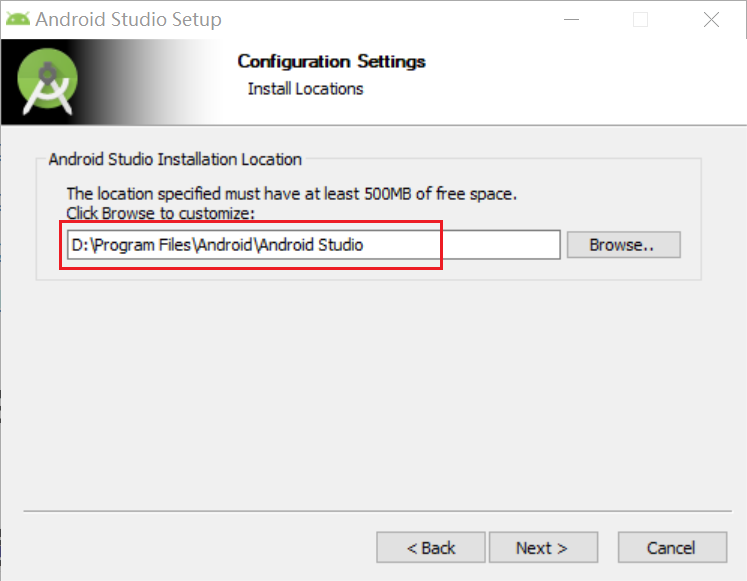

3. 配置Android Studio

   （1）安装完成后，启动Android Studio，在以下窗口中选择不导入配置信息。

   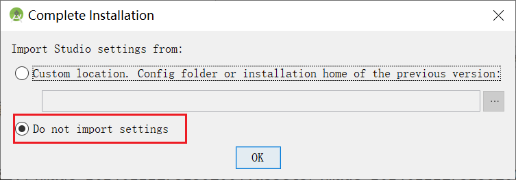

   （2）在弹出的窗口中点击”Cancel“按钮。

   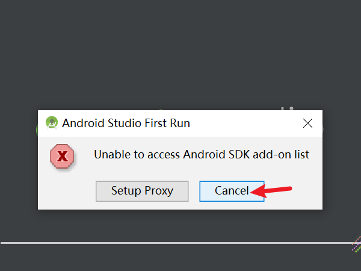

   （3）一直”Next“到Install Type页面，设置UI主题并选择”Custom“指定SDK安装路径，这里默认会安装最新版SDK且不能修改SDK版本。

   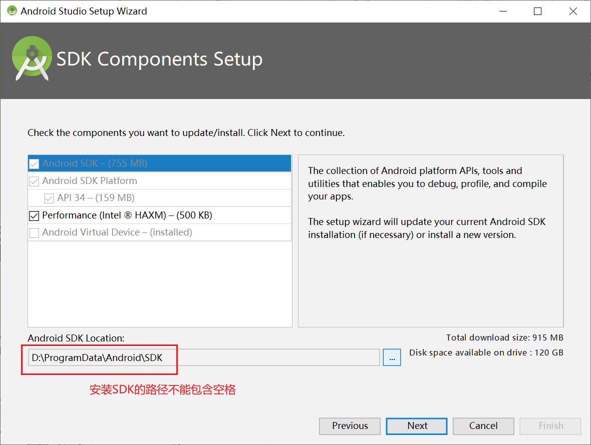

   （4）一直点击”Next”直到配置完成。

   注意：新建的配置信息会保存到 `C:\Users\<user>\.AndroidStudio3.2` 文件夹，此文件夹下在卸载时不会自动删除，建议卸载完成后手动删除该文件夹，避免下次安装出现问题。完全卸载Android Studio教程：[完全卸载Android studio教程_android studio如何彻底卸载重装-CSDN博客](https://blog.csdn.net/qq_46941656/article/details/119918496)。

### 1.2.2  在Android Studio中下载SDK

**下载SDK 9.0及相应的Tools。**

（1）打开SDK Manager。

​          打开Android Studio，点击右下角【Configure】→【SDK Manager】。

​         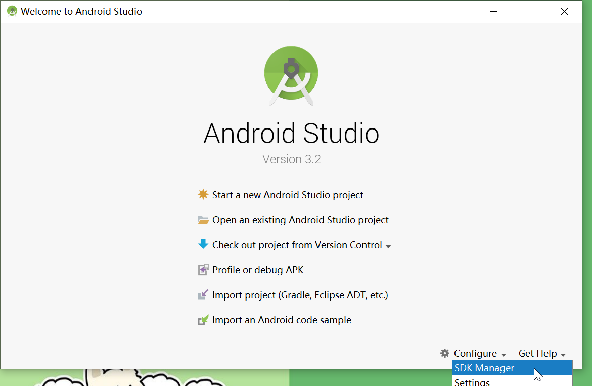

（2）下载SDK。

​           在打开窗口中“SDK Platforms”选项卡下选择Android 9.0 (Pie)，点击“OK”按钮进行下载。

​          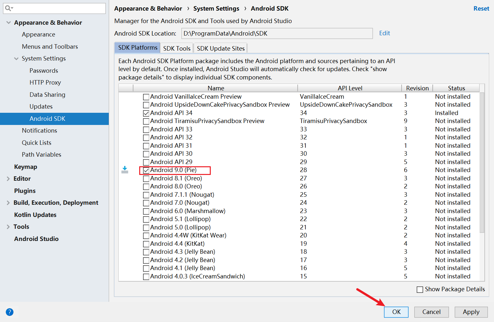

（3）下载Tools。

​           Android 9.0对应的API级别是28，因此需要下载版本号以“28”开头的的SDK Tools，点击“OK”按钮进行下载。

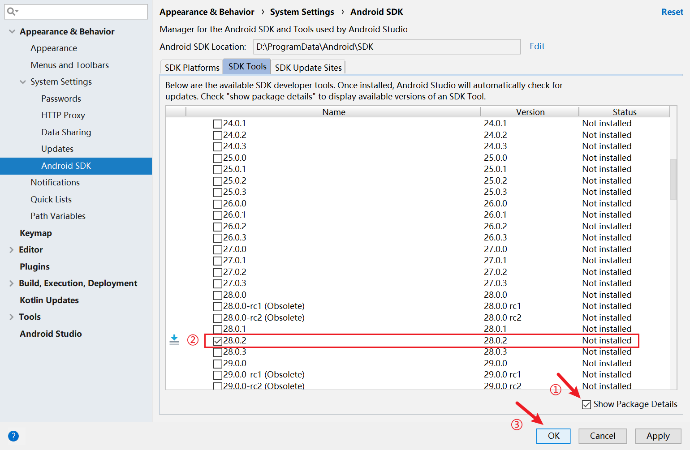

​      

（4）删除掉最新版本的SDK及Tools。方法为去掉相应版本前的对勾，然后点击“OK”按钮。

### 1.2.3 创建模拟器

#### 1.2.3.1 创建Android Studio 自带的AVD模拟器

（1）通过创建 `ANDROID_SDK_HOME` 环境变量指定AVD保存路径（AVD默认会下载到C盘；`ANDROID_SDK_HOME`示例值：`D:\Softwares\Android\AVD`）。参考[更改Android Studio中AVD的默认路径-CSDN博客](https://blog.csdn.net/qq_45458915/article/details/113914691)

（2）从[Gradle Distributions](https://services.gradle.org/distributions/)下载[gradle-4.6-all.zip](https://services.gradle.org/distributions/gradle-4.6-all.zip)，放到`%GRADLE_USER_HOME%\wrapper\dists\gradle-4.6-all\bcst21l2brirad8k2ben1letg`目录中（`GRADLE_USER_HOME`示例值：`D:\ProgramData\Android\.gradle`）。参考[Android Studio 中 gradle 下载失败的解决办法-CSDN博客](https://blog.csdn.net/Jia_Feng_/article/details/115268372)。

（3）使用Android Studio创建一个Android项目。（详细步骤参见1.3节内容）

 注意：如果没有预先安装SDK 9.0，此时项目会编译失败，原因是Android Studio 3.2.0最高只能支持到SDK 9.0，而安装Android Studio 3.2.0的过程中默认仅下载了最新版本的SDK，因此无法进行编译。

（4）打开项目后在单击顶部导航栏中的【AVD Manager】创建模拟器。选择【Phone】类型的【Nexus 4】设备，并下载Pie版本（Android 9.0；API 28）系统镜像。

#### 1.2.3.2 第三方模拟器：雷电模拟器、夜神模拟器

1. 雷电模拟器 

（1）下载雷电模拟器：[雷电模拟器9.0](https://res.ldmnq.com/download/leidian9/ldinst_9.0.66.exe)

（2）双击下载好的`.exe`文件进行安装。安装完成后默认会创建一个安卓模拟器并启动，启动后Android Studio中就可以自动连接上。

2. 夜神模拟器 **（不推荐）**

（1）下载夜神模拟器：[nox_setup_v7.0.5.9_full.exe](https://www.yeshen.com/)。

（2）双击下载好的`.exe`文件进行安装。**（需要关闭Hyper-V）**

（3）打开模拟器助手，创建Android 9模拟器。

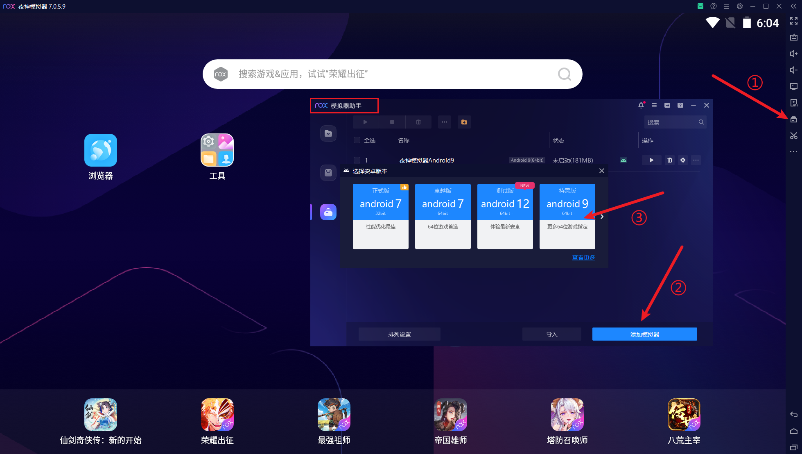

（4）启动夜神模拟器Android 9。

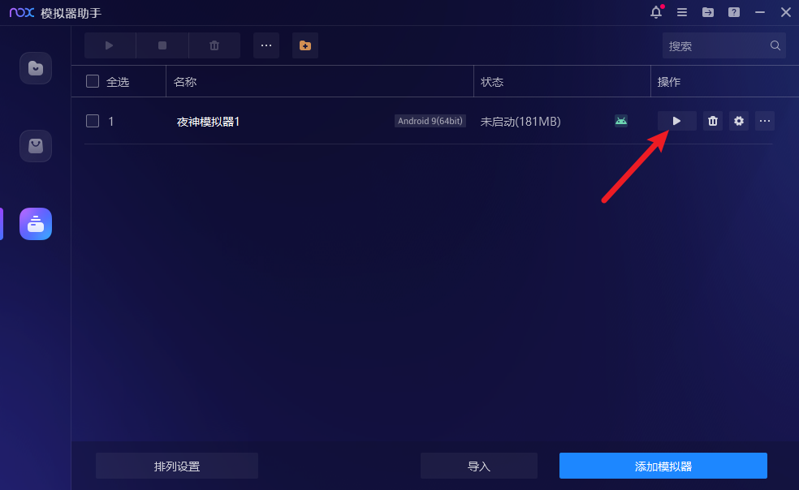

（5）连接夜神模拟器。

​     win+R 启动CMD命令后，cd到夜神安装目录，我的目录是D:\Program Files\Nox\bin下。先执行`nox_adb devices`查看设置端口号（默认为62025），然后执行命令`nox_adb.exe connect 127.0.0.1:62025`连接到模拟器。

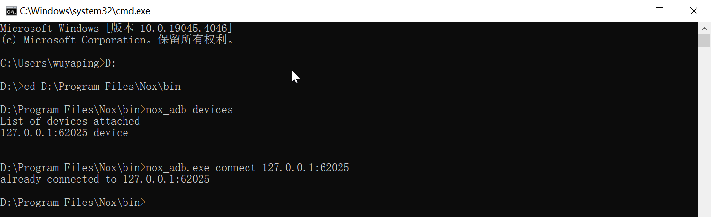

运行项目时即可选择夜神模拟器。

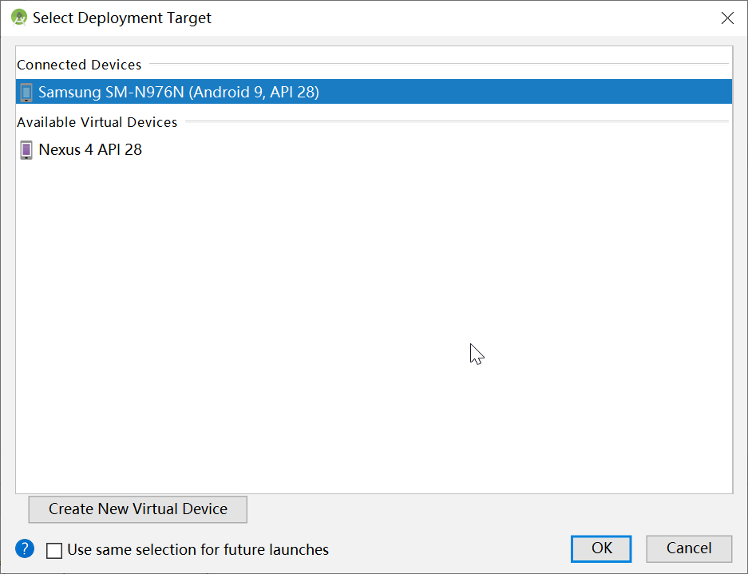

#### 1.2.3.3 真机模拟器

**参考资料：**

1. [Android Studio 模拟器的选择和安装 - 知乎 (zhihu.com)](https://zhuanlan.zhihu.com/p/33029724)
1. [Android Studio的下载、安装及配置教程(自带模拟器与夜神模拟器调试)_android studio的模拟器下载游戏-CSDN博客](https://blog.csdn.net/hitler_yuzhan/article/details/119037791)
1. [如何创建不同安卓版本/位数的模拟器？ | 夜神模拟器帮助中心 (yeshen.com)](https://support.yeshen.com/zh-CN/often/multi-drive3)
1. [无法连接夜神模拟器，unable to connect to 127.0.0.1:62001-CSDN博客](https://blog.csdn.net/qq_41561243/article/details/81043610)
1. [android studio使用雷电模拟器-CSDN博客](https://blog.csdn.net/weixin_43157543/article/details/104589328)
1. [雷电模拟器绿色版下载](https://www.gndown.com/554.html)

## 1.3 开发第一个Android程序

### 1.3.1 创建Hello World程序


### 1.3.2 在已有项目中新建Module

1、在Project窗口中空白处右键，选择【New】→【Module】。

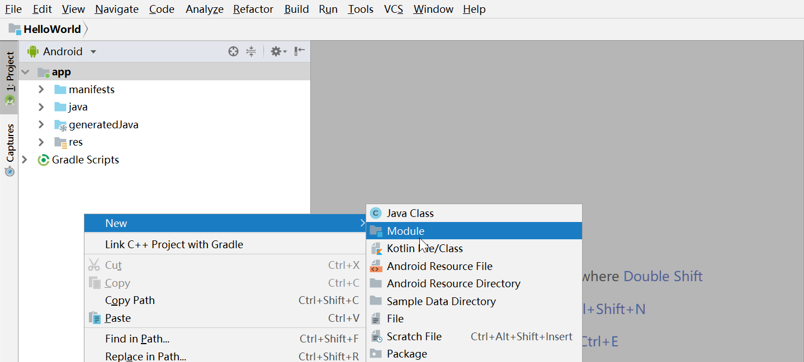

2、在打开的窗口中选择Phone & Tablet Module，点击“Next”按钮。

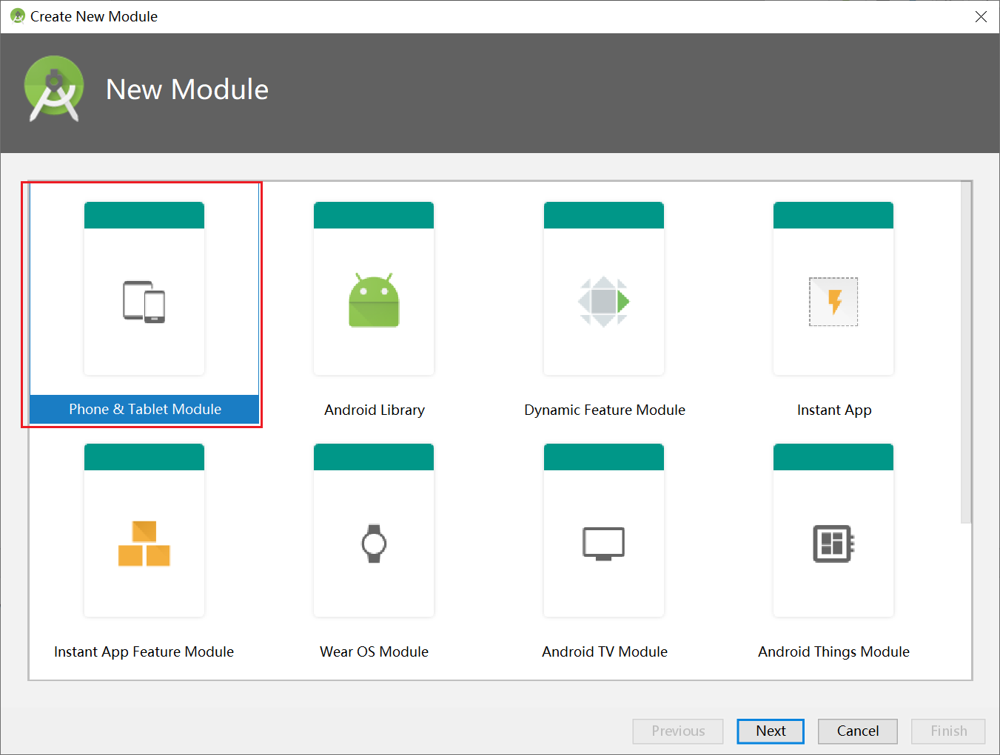

3、Application/Library name是应用的名字（在桌面用户看到的名字，可以为中文），Module name是在android studio目录下显示的名字 。

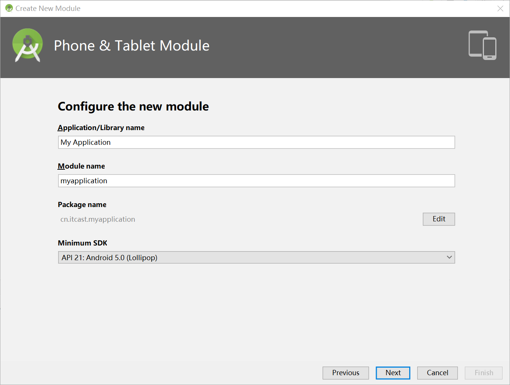

4、后续步骤一直点击“Next”按钮，最后点击“FInish”完成创建。

### 1.3.3 构建离线开发环境

联网环境下生成的gradle仓库不能直接复制离线环境下使用，为了在无法联网的环境中构建项目，需要创建gradle的离线仓库。本文中采用的方法是先将联网环境下生成的gradle仓库转换成maven本地仓库，然后将maven本地仓库配置为离线环境中的gradle的下载源。

1. 联网环境中将项目构建成功后，将Gradle工作模式切换为离线模式。

   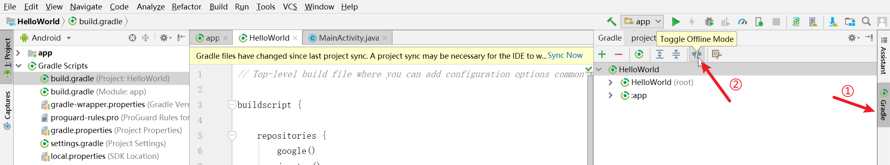

2. 将gradle仓库转换成maven仓库。

   然后在项目的build.gradle文件最后添加一个task，将jar包从gradle的缓存目录转移到maven本地仓库，gradle的缓存目录一般默认在`%GRADLE_USER_HOME%\caches\modules-2\files-2.1\`。具体代码如下：

   ```groovy
   task cacheToLocalMavenRepository(type: Copy) {
       // gradle缓存目录
       from new File('D:\\ProgramData\\Android\\.gradle\\caches\\modules-2\\files-2.1')
       // maven本地仓库路径
       into 'D:\\ProgramData\\Android\\m2repository'
       eachFile {
           List<String> parts = it.path.split('/')
           it.path = (parts[0]+ '/' + parts[1]).replace('.','/') + '/' + parts[2] + '/' + parts[4]
       }
       includeEmptyDirs false
   }
   ```

   再在Terminal中执行这个task，命令为`gradlew cacheToLocalMavenRepository `。

   执行完成后，jar包就转移到了本地maven仓库中。

   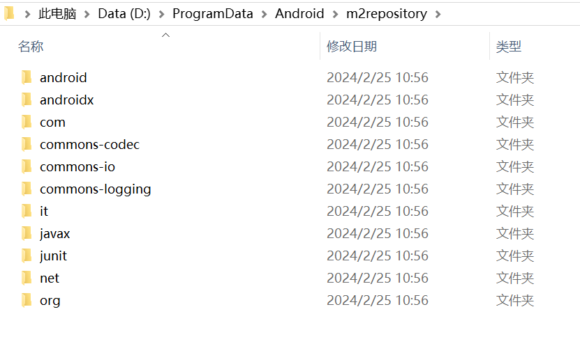

3. 将gradle下载源配置为maven仓库。

   在项目的build.gradle中修改gradle的下载源，首先注释掉默认的网络下载源，然后将本地maven仓库配置为新的下载源。具体代码如下：

   ```groovy
   buildscript {
       
       repositories {
   //        google()
   //        jcenter()
   // 配置本地maven仓库
           maven{
               url 'file:///D://ProgramData//Android//m2repository'
           }
       }
       dependencies {
           classpath 'com.android.tools.build:gradle:3.2.0'
           
   
           // NOTE: Do not place your application dependencies here; they belong
           // in the individual module build.gradle files
       }
   }
   
   allprojects {
       repositories {
   //        google()
   //        jcenter()
   // 配置本地maven仓库
           maven{
               url 'file:///D://ProgramData//Android//m2repository'
           }
       }
   }
   ```

   配置完成后，点击“Sync Project with Gradle Files”按钮。此时，build可能会失败。

   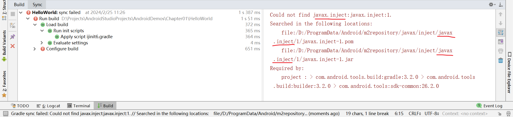

   报错信息显示有个包找不到，这是因为在将gradle仓库中的jar包转移到maven仓库时，使用“/”将包名中的“.”切分成了路径，导致包名中带“.”的包（“javax.inject”）转换有误，此时需要手动去maven仓库中进行调整。

   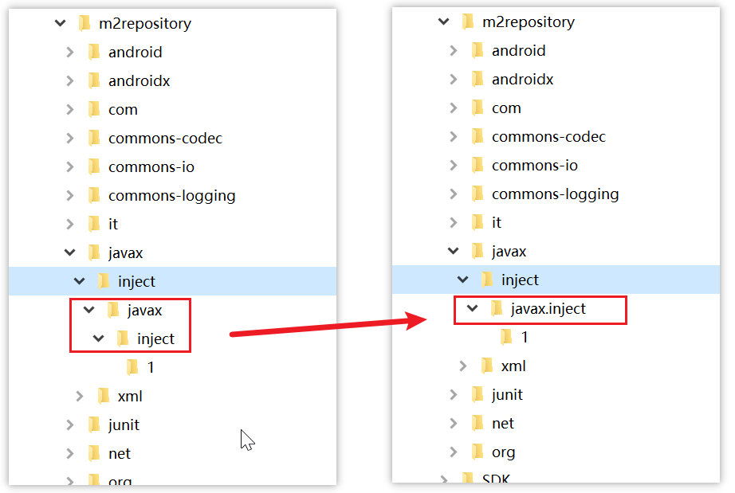

   调整完成后，再重新进行同步，如果出现类似错误采用相同方法解决即可。

4. 使用gradle初始化脚本配置本地仓库地址。

   在`USER_HOME/.gradle`或者`GRADLE_HOME`目录下创建一个`init.gradle`文件，内容如下：

   ```groovy
   allprojects {
   	repositories {
   		maven { url 'file:///D://ProgramData//Android//m2repository'}
   	}
   }
   ```

   添加此文件后，在项目中使用gradle构建时，会优先从该文件配置的仓库中下载所需依赖。

**参考资料：**

1. [gradle和maven能否共用本地仓库？gradle使用maven本地仓库又是什么？ - 简书 (jianshu.com)](https://www.jianshu.com/p/880385a60c2b)
2. [将Gradle缓存的jar包转移到maven本地仓库-CSDN博客](https://blog.csdn.net/DWBa_recruit/article/details/133053705)
3. [android studio构建离线环境以及uniapp离线打包_哔哩哔哩_bilibili（8:44）](https://www.bilibili.com/video/BV1me4y1H7qW/?spm_id_from=333.880.my_history.page.click&vd_source=4d1c29b7180c020aa81be197c9a933de)
4. [gradle使用阿里源及设置初始化脚本_initialization script gradle-CSDN博客](https://blog.csdn.net/qq_36666651/article/details/80718978)

## 1.5 资源的管理与使用

Android程序中的资源都保存在res目录下，这些文件最终都会被编译到R文件中，R文件中针对不同类型的资源会生成相应的类用于保存资源id，R文件具体位置如下图所示。

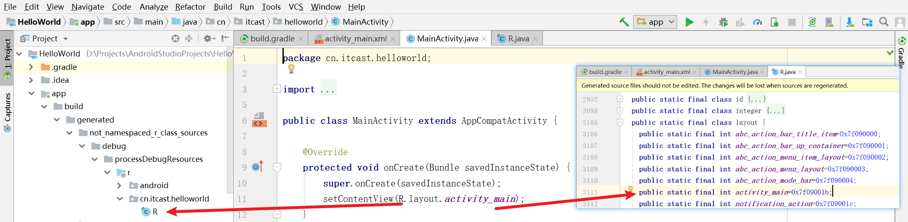

### 1.5.1 图片资源

图片资源存放在`res`目录下的`mipmap`（应用图标）和`drawable`（界面中使用的图片）开头的目录中。

`drawable`资源可以使用图片资源，也可以使用xml文件资源。常用的`drawable`资源有图片资源和StateListDrawable资源两种。

根据设备的不同尺寸，Android中的图片资源存放在对应名称（mdpi hdpi xhdpi xxhdpi xxxhdpi）的文件夹中。但是同时保存不同尺寸的图片占用的空间会很大，为了节省空间，可以只保存分辨率最高的图片。

参考资料：[Android开发小技巧-图片资源管理 - 掘金 (juejin.cn)](https://juejin.cn/post/7111221172297007118)

由于res目录中的资源在编译后才会在R文件中生成对应的id值，因此在项目中添加图片后，需要先点击【Build】→【Rebuild Project】进行重新编译，再引用相应的资源。

**练习题**：在`AndroidManifest.xml`文件中将应用图标修改为`fengche.png`。

图标资源可在[iconfont-阿里巴巴矢量图标库](https://www.iconfont.cn/collections/detail?spm=a313x.collections_index.i1.d9df05512.403a3a81PaIMpT&cid=47966)下载。下载图标时应根据实际需要选择图标大小。例如：`Nexus 4`的屏幕密度是`xhdpi`，应下载尺寸为`96x96`的图标，下载后放置到项目中对应的资源文件夹（`res/mipmap-xhdpi`）中。

不同大小屏幕对应的图标尺寸如下：

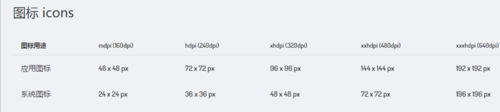

**扩展阅读：**

1. [Android Studio制作分辨率适配图标-CSDN博客](https://blog.csdn.net/weixin_42664622/article/details/107377267)
2. [.9.PNG是啥？ - 知乎 (zhihu.com)](https://zhuanlan.zhihu.com/p/32581846)
3. [合理使用 selector，彻底告别手动改变 drawable、color - 简书 (jianshu.com)](https://www.jianshu.com/p/585c9a29b152)

### 1.5.2 主题和样式资源

主题和样式主要用于定义安卓界面元素的显示风格。

#### 1. 主题

主题主要用于设置整个项目或Activity的显示风格。主题资源定义在 `res/values` 目录下的 `styles.xml` 文件中，示例代码：

```xml
<!-- style标签用于定义主题。
     name：主题名称；parent：指定Android提供的父主题 -->
<style name="AppTheme" parent="Theme.AppCompat.Light.DarkActionBar">
    	<!-- item标签用于设置主题的样式 -->
        <item name="colorPrimary">@color/colorPrimary</item>   <!-- 标题栏颜色 -->
        <item name="colorPrimaryDark">@color/colorPrimaryDark</item>   <!-- 状态栏颜色 -->
        <item name="colorAccent">@color/colorAccent</item>   <!-- 控件被选中时的颜色 -->
  </style>
```

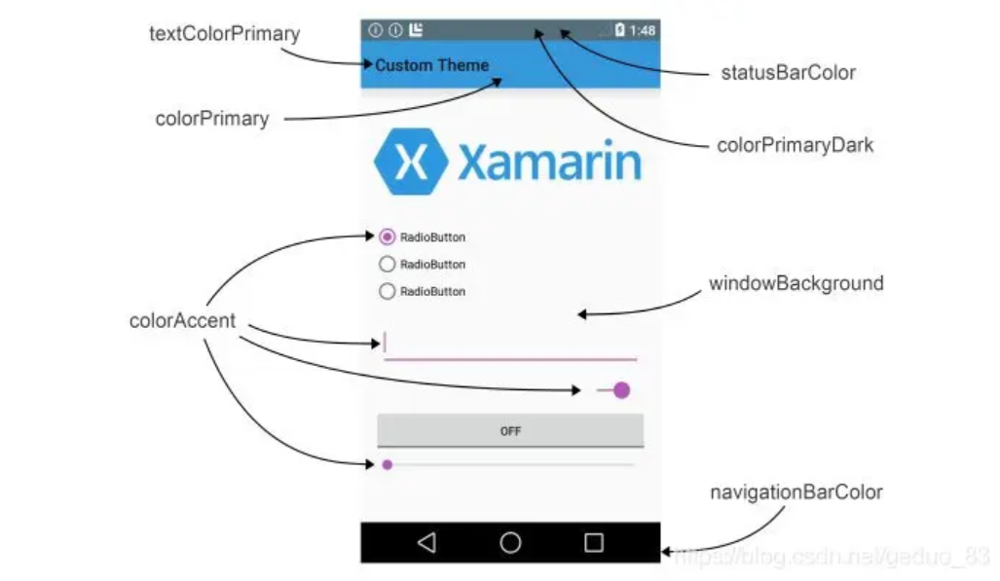

设置主题的方式有两种。

（1）在`AndroidManifest.xml`文件中设置主题。

```xml
<!-- 设置整个App的主题 -->
<application android:theme="@style/AppTheme">
    
</application>

<!-- 设置某个Activity的主题 -->
<activity android:theme="@style/AppTheme">

</activity>
```

（2）在Java代码中设置（Activity的）主题。

```java
protected void onCreate(Bundle savedInstanceState) {
     super.onCreate(savedInstanceState); 
     setTheme(R.style.AppTheme);   //要在setContentView之前设置
     setContentView(R.layout.activity_main); 
}
```

#### 2. 样式

样式主要用于设置View控件的显示风格。样式也存放在 `res/values` 目录下的 `styles.xml` 文件中，定义方式与主题类似。示例代码：

```xml
<style name="textViewStyle">
    <item name="android:background">#f54e39</item>
</style>
```

在布局文件中引用`textViewStyle`的代码示例：

```xml
<TextView
    android:layout_width="wrap_content"
    android:layout_height="wrap_content"
    android:text="Hello World!"
    app:layout_constraintBottom_toBottomOf="parent"
    app:layout_constraintLeft_toLeftOf="parent"
    app:layout_constraintRight_toRightOf="parent"
    app:layout_constraintTop_toTopOf="parent"
    style="@style/textViewStyle"/>
```

**注意：**android的样式采取和css中一样的覆盖、继承原则，如果一个TextView自己设置了样式，它的ViewGroup设置了样式，activity设置了主题，application设置了主题。它会先读取自己样式的值，对于自己没有的样式向上查找第一个找到的值即为要采取的值。原文链接：https://blog.csdn.net/OnlyOneCoder/article/details/8536814。

**练习题：**

1. 定义一个主题`MyTheme`，设置父主题为`Theme.AppCompat.Light.NoActionBar`，`item`标签与`AppTheme`主题的保持一致，运行`HelloWorld`项目，观察界面显示风格。
2. 按照课本的代码定义`textViewStyle`样式并应用到布局文件中。

**扩展阅读：**

1. [Android主题的常用属性 - 简书 (jianshu.com)](https://www.jianshu.com/p/632a94bbd404)
2. [Android主题用法及安卓界面组成 - 知乎 (zhihu.com)](https://zhuanlan.zhihu.com/p/139108501)
3. [Android主题发展历程及介绍-CSDN博客](https://blog.csdn.net/tuke_tuke/article/details/73188426)

### 1.5.3 布局资源

布局资源通常用于搭建程序中的各个界面。布局资源在`res/layout`目录中创建，新建项目时默认会创建一个`activity_main.xml`的布局文件。

调用方式：

- 通过java代码调用

```java
//在Activity的onCreate()方法中调用activity_main.xml布局文件
  setContentView(R.layout.activity_main);
```

- 通过xml文件调用

  先创建一个新的activity文件，方法为在`res/layout`目录上右键，选择【New】→【XML】→【Layout XML File】，在弹出的窗口中设置布局名称（Layout File Name）为 layout_test，布局的根节点（Root Tag）使用默认值 LinearLayout，点击【Finish】。

  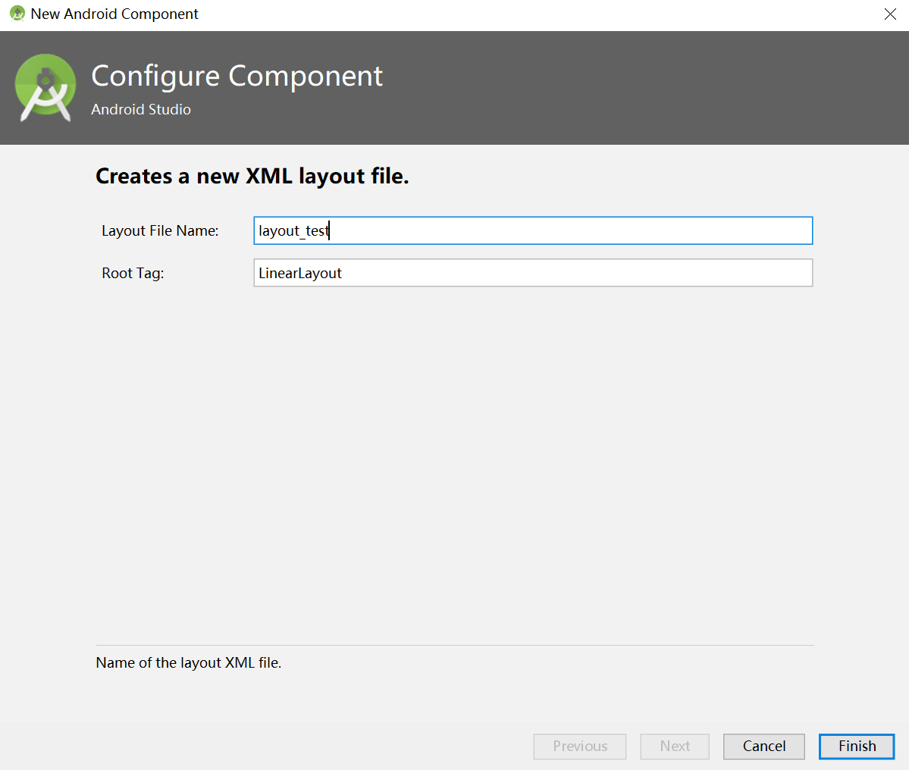

  创建完成后，在创建好的新activity文件（`layout_test.xml`）中使用`<include>`标签调用 `activity_main.xml` 布局资源。

  ```xml
  <?xml version="1.0" encoding="utf-8"?>
  <LinearLayout xmlns:android="http://schemas.android.com/apk/res/android"
      android:layout_width="match_parent"
      android:layout_height="match_parent">
  
      <include layout="@layout/activity_main"></include>
  
  </LinearLayout>
  ```

### 1.5.4 字符串资源

字符串资源在`res/values/strings.xml`文件中定义。示例代码如下：

```xml
<resources>
    <string name="app_name">HelloWorld</string>
</resources>
```

字符串资源的调用方式有两种：

- 在Java代码（MainActivity.java）中调用

  ```java
  protected void onCreate(Bundle savedInstanceState) {
      super.onCreate(savedInstanceState);
      setContentView(R.layout.activity_main);
      //在Activity的onCreate()方法中调用名为 app_name 的字符串资源
      getResources().getString(R.string.app_name);
  }
  ```

- 在XML布局文件（activity_main.xml）中调用

  ```xml
  <!-- 设置文字内容为名为 app_name 的字符串资源 -->
  <TextView
      android:layout_width="wrap_content"
      android:layout_height="wrap_content"
      android:text="@string/app_name"
      app:layout_constraintBottom_toBottomOf="parent"
      app:layout_constraintLeft_toLeftOf="parent"
      app:layout_constraintRight_toRightOf="parent"
      app:layout_constraintTop_toTopOf="parent"/>
  ```

**练习题：**根据课本中提供的代码进行练习。

### 1.5.5 颜色资源

颜色资源通常定义在`res/values/colors.xml`文件中，示例代码如下：

```xml
<?xml version="1.0" encoding="utf-8"?>
<resources>
    <color name="colorPrimary">#008577</color>
    <color name="colorPrimaryDark">#00574B</color>
    <color name="colorAccent">#D81B60</color>
</resources>
```

调用颜色资源的方法同样有两种。

- 在Java代码中（MainActivity.java）调用。

  ```java
  protected void onCreate(Bundle savedInstanceState) {
      super.onCreate(savedInstanceState);
      setContentView(R.layout.activity_main);
      //在Activity的onCreate()方法中调用名为 colorPrimary 的字符串资源  
      getResources().getColor(R.color.colorPrimary)
  }
  ```

- 在XML布局文件中调用。

  ```xml
  <!-- 设置字体颜色为名为 colorAccent 的颜色资源 -->
  <TextView
      android:layout_width="wrap_content"
      android:layout_height="wrap_content"
      android:text="Hello World!"
      app:layout_constraintBottom_toBottomOf="parent"
      app:layout_constraintLeft_toLeftOf="parent"
      app:layout_constraintRight_toRightOf="parent"
      app:layout_constraintTop_toTopOf="parent"
      android:textColor="@color/colorAccent"/>
  ```

**练习题：**

1. 设置`TextView`控件中的字体颜色为`colorAccent`。

### 1.5.6 尺寸资源

尺寸资源可用于定于View控件的宽高等，通常在`res/values/dimens.xml`文件中使用`<dimen>`标签定义。在Android Studio 3.2.0中，默认没有创建该文件，需要手动创建，创建方法为在`res/values`文件夹上右键，依次选中【New】→【XML】→【Values XML File】即可创建`dimens.xml`文件。

**px**（pixels，像素）：每个像素点对应屏幕上的一个点。

**dpi**（dots per inch，像素密度）：单位英寸上的像素数量。

**dp**（Density-independent Pixels，设备独立像素）：与屏幕无关的尺寸单位，图片大小单位。Android中的尺寸单位使用 dp 而不是百分比可以避免横屏时某些控件变形，详见[Android屏幕适配之单位DP - 简书 (jianshu.com)](https://www.jianshu.com/p/9dfa9dc1652b)。

安卓屏幕像素密度关系：

| 屏幕密度类型            | 分辨率（px） | 屏幕像素密度（dpi） | 像素比（px/dp） |
| ----------------------- | ------------ | ------------------- | --------------- |
| 低密度（ldpi）          | 240x320      | 120                 | 0.75            |
| 中密度（mdpi）          | 320x480      | 160                 | 1               |
| 高密度（hdpi）          | 480x800      | 240                 | 1.5             |
| 超高密度（xhdpi）       | 720x1280     | 320                 | 2               |
| 超超高密度（xxhdpi）    | 1080x1920    | 480                 | 3（1dp=3px）    |
| 超超超高密度（xxxhdpi） | 2160x3840    | 640                 | 4               |

**参考资料：**

1. [干货 | 安卓界面系统规范 - 知乎 (zhihu.com)](https://zhuanlan.zhihu.com/p/182417970)

2. [Android 常见分辨率 —— mdpi、hdpi 、xhdpi、xxhdpi-CSDN博客](https://blog.csdn.net/adminlxb89/article/details/82492059)


## 1.6 程序调试

### 1.6.1 单元测试

### 1.6.2 Logcat的使用

