# 第3章 Android常见界面控件

## 3.1 简单控件的使用

### 3.1.1 TextView控件（继承自View控件）

#### 3.1.1.1 常用属性

1. android:lines和android:maxLines的区别

   当文本实际内容小于android:lines设置的行数时，TextView控件的高度为android:lines设置行数；当文本实际内容小于android:maxLines设置的行数时，TextView控件的高度以实际行数为准。

   当文本实际内容大于设置的行数时，这两个属性表现一致。

   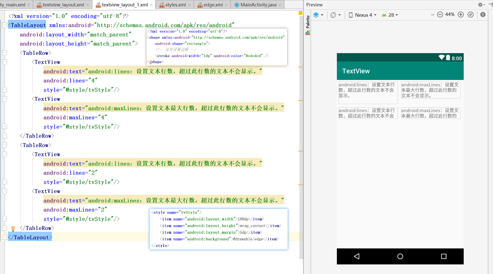

2. android:drawableLeft  在文本左侧显示指定图像

   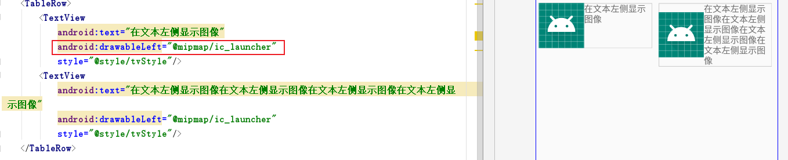

3. android:lineSpacingExtra 设置文本的额外行间距

   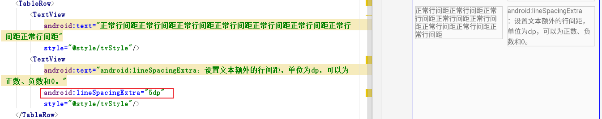

#### 3.1.1.2 使用案例

（1）新建子项目 TextView

（2）新建布局文件 textview_layout.xml

（3）在布局文件中放置TextView控件，设置其中的文本的文字大小、颜色、位置和字体。

（4）在Java文件中加载该布局文件，并运行程序。

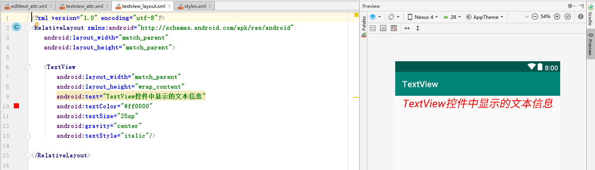

参考资料：

1. [在Android Studio的drawable文件下创建XML文件-CSDN博客](https://blog.csdn.net/liqian321/article/details/48519349)
2. [Android 对控件设置边框样式（边框颜色，圆角）和图片样式（圆角） - 博客园](https://www.cnblogs.com/zoro-zero/p/12621050.html)
3. [android:layout_gravity和android:gravity的可选值详解-CSDN博客](https://blog.csdn.net/a87b01c14/article/details/49363955)

### 3.1.2 EditText控件（继承自TextView控件）

#### 3.1.2.1 常用属性

| 属性名称                   | 功能描述                                             | 替代属性名称                     |
| -------------------------- | ---------------------------------------------------- | -------------------------------- |
| android:hint               | 控件中内容为空时显示的提示文本信息                   |                                  |
| android:textColorHint      | 控件中内容为空时显示的提示文本信息的颜色             |                                  |
| ~~android:password~~       | 输入文本框中的内容显示为“.”                          | android:inputType="textPassword" |
| ~~android:phoneNumber~~    | 设置输入文本框中的内容只能是数字                     | android:inputType="phone"        |
| android:minLines           | 设置文本的最小行数                                   |                                  |
| android:scrollHorizontally | 设置文本信息超出EditText的宽度情况下，是否出现横拉条 |                                  |
| ~~android:editable~~       | 设置是否可编辑                                       | android:focusable="false"        |

#### 3.1.2.2 使用案例

（1）新建子项目 EditText。

（2）新建布局文件 edittext_layout.xml。

（3）在布局文件中放置一个 TextView 控件和一个 EditText  控件，设置 EditText 控件中提示文本颜色为灰色，设置 EditText 控件中显示的文本颜色为红色。

（4）在Java文件中加载该布局文件，并运行程序。

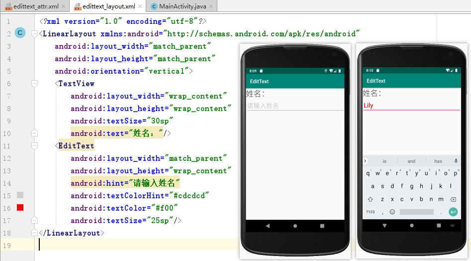

### 3.1.3 Button 控件（继承自TextView控件）

Button 控件继承自 TextView 控件，既可以显示文本，又可以显示图片。

#### 3.1.3.1 Button 控件设置点击事件的三种相应方式

1. 在布局文件中指定 onClick 属性的值。

   布局文件代码如下：

   ```xml
   <Button android:id="@+id/btn_1"
           android:onClick="click"/>
   ```

   在avtivity中实现点击事件的java代码如下：

   ```java
   public void click(View view){
       // 实现点击事件的代码
       // 获取触发点击事件控件的方法有两种。
       // 方法一：Button btn = (Button)view;
       // 方法二：在onCreate()方法中通过findViewById()方法获取
   }
   ```

   注意：java代码中实现点击事件的方法名必须与onClick属性中指定的方法名相同。

2. 在Activity中使用匿名内部类。

   具体的java代码如下：

   ```java
   btn.setOnClickListener(new View.OnClickListener(){
   
       @Override
       public void onClick(View v) {
           // 实现点击事件的代码
       }
   });
   ```

   监听到Button控件被点击时，程序会调用匿名内部类中的onClick()方法。

3. 使用 Activity 实现 **View.OnClickListener** 接口。

   具体的java代码如下：

   ```java
   public class MainActivity extends AppCompatActivity implements View.OnClickListener {
       @Override
       protected void onCreate(Bundle savedInstanceState) {
           ...
           // btn为触发点击事件的控件
           btn.setOnClickListener(this);
       }
   
       @Override
       public void onClick(View v) {
           // 实现点击事件的代码
       }
   }
   ```

   快速生成实现接口中方法的代码：在接口名称上右键，选择【Generate...】→【Implement methods...】。

#### 3.1.3.2 使用案例

1. 新建子项目 Button。

2. 新建布局文件 button_layout.xml，放置3个 Button 控件。

   button_layout.xml的具体代码如下：

   ```xml
   <?xml version="1.0" encoding="utf-8"?>
   <LinearLayout xmlns:android="http://schemas.android.com/apk/res/android"
       android:layout_width="match_parent"
       android:layout_height="match_parent"
       android:orientation="vertical">
       <Button
           android:id="@+id/btn_1"
           android:layout_width="match_parent"
           android:layout_height="wrap_content"
           android:text="按钮1"
           android:onClick="click"/>
       <Button
           android:id="@+id/btn_2"
           android:layout_width="match_parent"
           android:layout_height="wrap_content"
           android:text="按钮2"/>
       <Button
           android:id="@+id/btn_3"
           android:layout_width="match_parent"
           android:layout_height="wrap_content"
           android:text="按钮3"/>
   
   </LinearLayout>
   ```

   界面效果图如下图所示：

   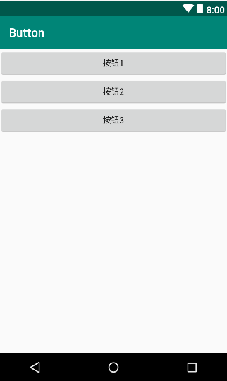

   

3. Java代码中加载button_layout.xml布局文件，并实现点击事件，点击每个按钮时打印相应的日志信息。

   MainActivity.java 中的具体代码如下：

   ```java
   package cn.itcast.button;
   
   import android.support.v7.app.AppCompatActivity;
   import android.os.Bundle;
   import android.util.Log;
   import android.view.View;
   import android.widget.Button;
   
   public class MainActivity extends AppCompatActivity implements View.OnClickListener {
   
       private Button btn_1, btn_2, btn_3;
   
       @Override
       protected void onCreate(Bundle savedInstanceState) {
           super.onCreate(savedInstanceState);
           // 加载button_layout布局
           setContentView(R.layout.button_layout);
           btn_1 = findViewById(R.id.btn_1);
           btn_2 = findViewById(R.id.btn_2);
           btn_3 = findViewById(R.id.btn_3);
   
           // 实现按钮2的点击事件
           btn_2.setOnClickListener(new View.OnClickListener(){
   
               @Override
               public void onClick(View v) {
                   btn_2.setText("按钮2已被点击");
                   Log.i("MainActivity", "按钮2已被点击");
               }
           });
   
           // 实现按钮3的点击事件
           btn_3.setOnClickListener(this);
       }
   
       // 实现按钮1的点击事件
       public void click(View view){
           btn_1.setText("按钮1已被点击");
           Log.i("MainActivity", "按钮1已被点击");
       }
   
       // 实现按钮3的点击事件
       @Override
       public void onClick(View v) {
           btn_3.setText("按钮3已被点击");
           Log.i("MainActivity", "按钮3已被点击");
       }
   }
   ```

4. 运行程序。

   程序运行结果图如下：

   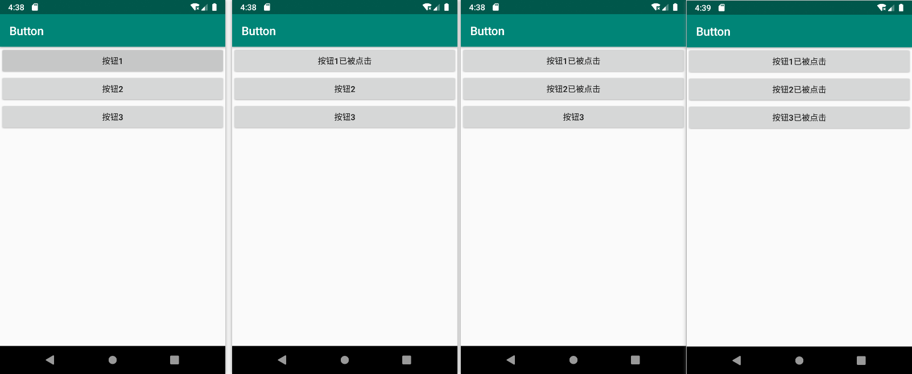

   运行程序后，使用日志过滤器过滤出标签为MainActivity的日志信息，日志窗口结果如下：

   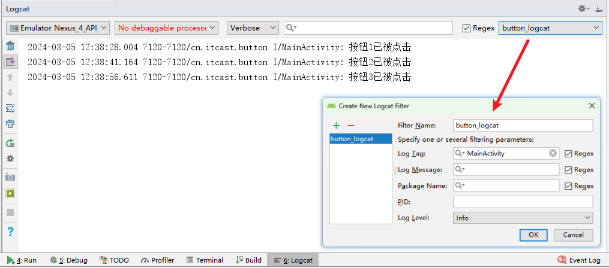

### 3.1.4 ImageView 控件（继承自View控件）

#### 3.1.4.1 常用属性

| 属性名称                   | 功能描述                                                     | 备注                                                         |
| -------------------------- | ------------------------------------------------------------ | ------------------------------------------------------------ |
| android:src                | 设置 ImageView 控件需要显示的图片资源                        |                                                              |
| android:background         | 设置 ImageView 控件的背景                                    | 图片会根据控件的大小进行伸缩                                 |
| android:scaleType          | 将图片资源缩放或移动，以适应ImageView控件的宽高  <br />可选值：center、centerCrop、centerInside、**fitCenter**（默认值）、fitEnd、fitStart、fitXY、matrix | [Android ImageView 的scaleType 属性图解 - 简书](https://www.jianshu.com/p/32e335d5b842) |
| android:tint               | 将图片渲染成指定的颜色                                       |                                                              |
| android:contentDescription | 图片内容描述信息                                             |                                                              |

#### 3.1.4.2 使用案例

1. 新建模块 ImageView

2. 新建布局文件imageview.xml

3. 在布局文件中添加 ImageView 控件

   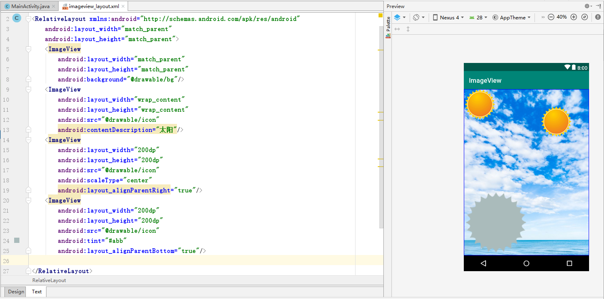

4. 在 activity 中加载 imageview.xml 布局文件，并运行程序。


### 3.1.5 RadioButton 控件

####  3.1.5.1 使用语法

RadioButton是单选按钮，通常放在RadioGroup中使用。通过android:check属性指定选中状态。

RadioButton继承自Button控件；RadioGroup继承自LinearLayout，可以通过orientation属性设置其中的RadioButton的布局方向。

XML中使用RadioButton和RadioGroup的语法：

```xml
<RadioGroup android:orientation="vertical">
    <RadioButton android:checked="true"/>
    <RadioButton android:checked="false"/>
</RadioGroup>
```

#### 3.1.5.2 使用案例

1. 创建模块 RadioButton

2. 新建布局文件 radiobutton_layout.xml，布局文件根标记修改为RelativeLayout，在该布局中放置界面控件。

   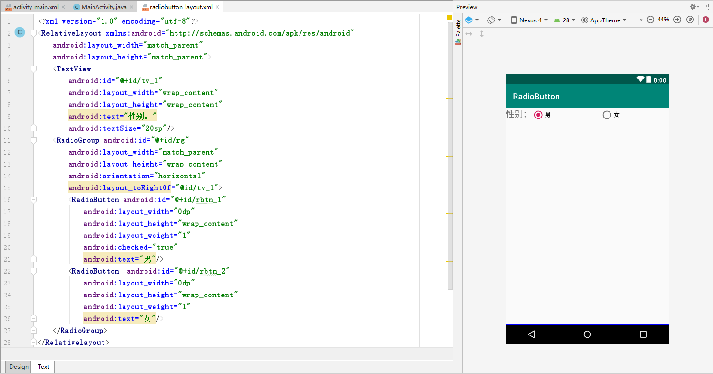

3. 设置 RadioGroup 的监听事件，点击单选按钮时在日志中打印相应的文本内容。

   （1）获取RadioGroup控件对象。
   （2）设置RadioGroup监听事件。
   （3）实现点击事件。

   ```java
   package cn.itcast.radiobutton;
   
   import android.support.v7.app.AppCompatActivity;
   import android.os.Bundle;
   import android.util.Log;
   import android.widget.Button;
   import android.widget.RadioButton;
   import android.widget.RadioGroup;
   
   public class MainActivity extends AppCompatActivity {
       @Override
       protected void onCreate(Bundle savedInstanceState) {
           super.onCreate(savedInstanceState);
           // 加载 radiobutton_layout 布局
           setContentView(R.layout.radiobutton_layout);
           RadioGroup radioGroup = findViewById(R.id.rg);
           // 实现 RadioGroup 的监听事件
           radioGroup.setOnCheckedChangeListener(
                   new RadioGroup.OnCheckedChangeListener(){
   
                       @Override
                       public void onCheckedChanged(RadioGroup group, int checkedId) {
                           Button btn;
                           if (checkedId == R.id.rbtn_1){
                               btn = findViewById(R.id.rbtn_1);
                               Log.i("MainActivity", "您选择的性别是" + btn.getText());
                           }
                           else{
                               btn = findViewById(R.id.rbtn_2);
                               Log.i("MainActivity", "您选择的性别是" + btn.getText());
                           }
                       }
                   }
           );
       }
   }
   ```

4. 运行程序。

   点击界面上”女“对应的单选按钮，日志窗口中会打印出被选中的按钮对应的文本信息。

   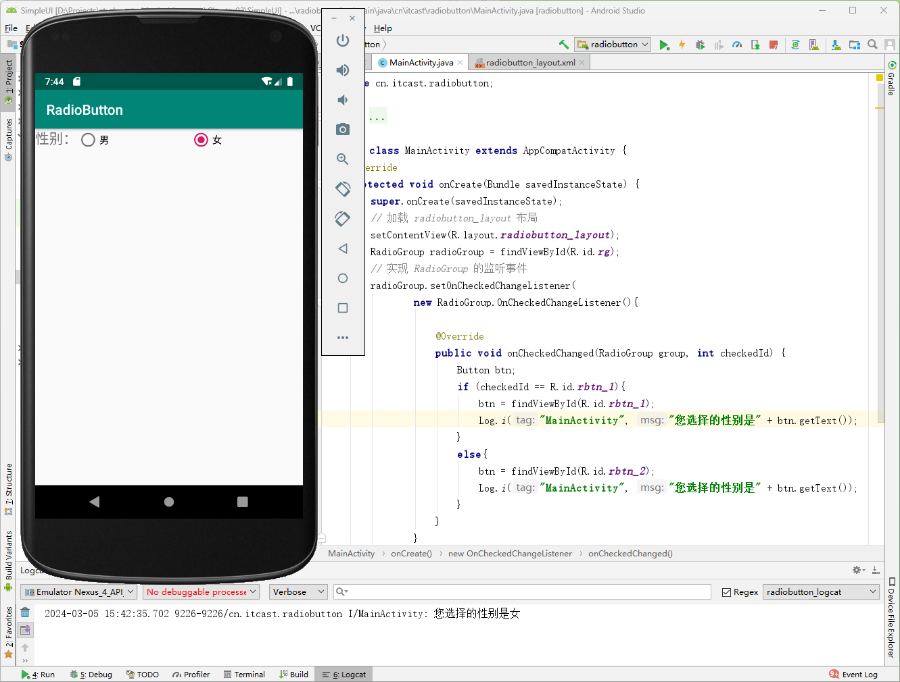

### 3.1.6 CheckBox控件

#### 3.1.6.1 控件介绍

CheckBox是复选框按钮，继承自抽象类CompoundButton，CompoundButton类继承自Button类。

复选框的选中的状态也是通过 android:checked 属性指定的。

####  3.1.6.2 使用案例

1. 新建模块 Checkbox

2. 新建布局文件 checkbox.xml，根标记修改为LinearLayout，在该布局文件中放置1个TextView控件和3个CheckBox控件。

   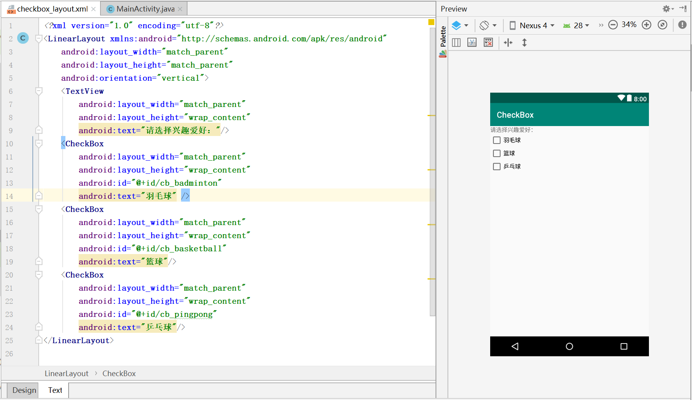

3. 在Activity中通过实现CompoundButton.OnCheckedChangeListener接口，并重写onCheckedChanged方法，实现CheckBox控件的点击事件。

   点击复选框时，在日志中打印所有选中的复选框中的文本内容。

   （1） 获取3个CheckBox控件对象
   （2）让MainActivity类实现CompoundButton.OnCheckChangeListener接口
   （3）设置CheckBox控件的点击事件
   （4）重写OnCheckedChanged()方法，在该方法中实现CheckBox控件的点击事件

   ```java
   package cn.itcast.checkbox;
   
   import android.support.v7.app.AppCompatActivity;
   import android.os.Bundle;
   import android.util.Log;
   import android.widget.CheckBox;
   import android.widget.CompoundButton;
   
   // MainActivity类实现CompoundButton.OnCheckChangeListener接口
   public class MainActivity extends AppCompatActivity implements CompoundButton.OnCheckedChangeListener {
   
       private String hobbys;
       @Override
       protected void onCreate(Bundle savedInstanceState) {
           super.onCreate(savedInstanceState);
           setContentView(R.layout.checkbox_layout);
           
           // 获取3个CheckBox控件对象
           CheckBox cb_badminton = findViewById(R.id.cb_badminton);
           CheckBox cb_basketball = findViewById(R.id.cb_basketball);
           CheckBox cb_pingpong = findViewById(R.id.cb_pingpong);
           
           // 设置CheckBox控件的点击事件
           cb_badminton.setOnCheckedChangeListener(this);
           cb_basketball.setOnCheckedChangeListener(this);
           cb_pingpong.setOnCheckedChangeListener(this);
   
           hobbys = new String();
       }
   
       @Override
       public void onCheckedChanged(CompoundButton buttonView, boolean isChecked) {
           // 实现点击事件
           String motion = buttonView.getText().toString() + " ";
           if(isChecked){
               if(!hobbys.contains(motion)){
                   hobbys = hobbys + motion;
               }
           }
           else{
               if(hobbys.contains(motion)){
                   hobbys = hobbys.replace(motion, "");
               }
           }
           Log.i("MainActivity", "您选择的爱好是：" + hobbys);
       }
   }
   ```

4. 运行程序。

   点击界面上的复选框，观察日志窗口中输出的日志信息。

   （1）选中”羽毛球“和”篮球“后，日志窗口中打印”您选择的爱好是：羽毛球 篮球“。

   （2）然后取消选择”羽毛球“，日志窗口中打印”您选择的爱好是：篮球“。

   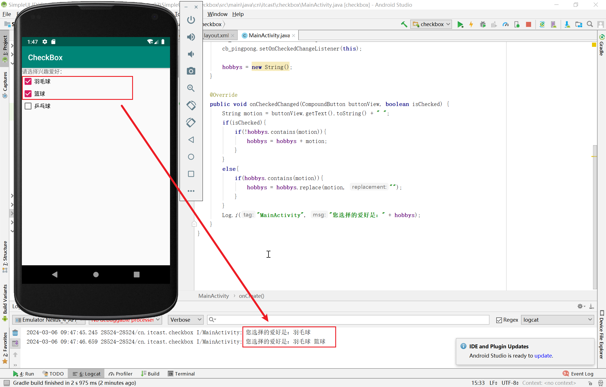

   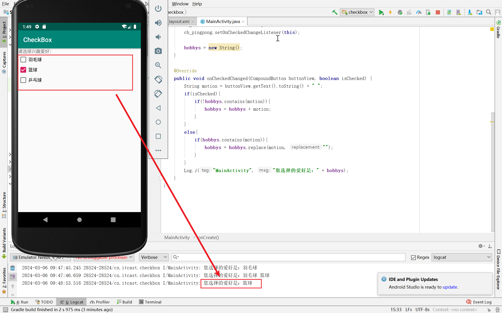

### 3.1.7 Toast类

#### 3.1.7.1 使用语法

Toast类是Android中的轻量级消息提醒机制，可用于向用户提示即时消息。

> toast本意是烘烤面包的意思，面包机烘烤完成后会发出通知，告知主人已经完成。

使用语法如下：

```java
// Context: 表示应用程序的环境信息，即当前组件的上下文环境。Context是一个抽象类，如果在activity中使用Toast，该参数可设置为“当前Activity.this”。
// Text: 提示的文本信息。
// Time: 显示信息的时长。可选值有Toast.LENGTH_SHORT和Toast.LENGTH_LONG两种。
Toast.makeText(Context, Text, time).show();
```

#### 3.1.7.2 使用案例

在CheckBox模块中，使用Toast类提示用户当前选中的所有兴趣爱好。

```java
Toast.makeText(MainActivity.this, "您选择的爱好是：" + hobbys,
                Toast.LENGTH_SHORT).show();
```

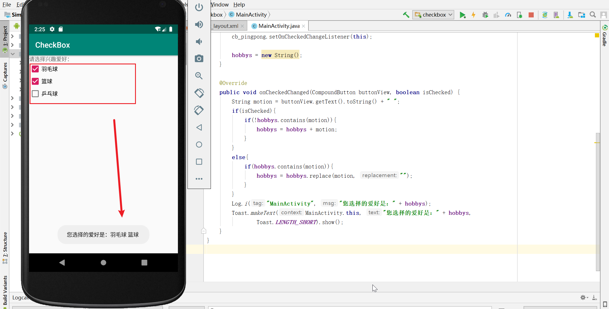

## 3.2 列表控件的使用

### 3.2.1 ListView 控件

#### 3.2.1.1 常用属性

| 属性名称              | 功能描述                                                     | 备注 |
| --------------------- | ------------------------------------------------------------ | ---- |
| android:listSelector  | 当条目被点击后，改变条目的背景颜色                           |      |
| android:divider       | 设置分割线的颜色                                             |      |
| android:dividerHeight | 设置分割线的高度                                             |      |
| android:scrollbars    | 是否显示滚动条                                               |      |
| android:fadingEdge    | 去掉上边和下边的黑色阴影                                     |      |
| android:entries       | 在res/layout的string.xml中添加的数组资源名称，数组资源使用`<string-array>`标签定义。 |      |

#### 3.2.1.2 常用数据适配器

1. BaseAdapter

   BaseAdapter顾名思义是基本的适配器。它实际上是一个抽象类，通常在自定义适配器时会继承BaseAdapter，该类拥有四个抽象方法，根据这几个抽象方法对ListView控件进行数据适配。BaseAdapter中的4个抽象方法如下表所示。

   | **方法名称**                                                 | **功能描述**                                                 | 备注                                                         |
   | ------------------------------------------------------------ | ------------------------------------------------------------ | ------------------------------------------------------------ |
   | public int getCount()                                        | 获取列表条目的总数                                           | 在进行数据适配时，**必须重写**                               |
   | public Object getItem(int position)                          | 根据position（位置）获取某个条目的对象                       | 可选重写，在某些ListView点击事件中会被用来获取当前条目的数据 |
   | public long getItemId(int position)                          | 根据position（位置）获取某个条目的id                         | 可选重写，在某些ListView点击事件中会被用来获取当前条目的id   |
   | public View getView(int position, View  convertView, ViewGroup parent) | 获取相应position对应的条目视图，position是当前条目的位置，convertView用于复用旧视图，parent用于加载XML布局。 | 在进行数据适配时，**必须重写**                               |

   参考资料：[android中Baseadapter的 getItem 和 getItemId 的作用和重写-CSDN博客](https://blog.csdn.net/u011494050/article/details/25471007)

2. SimpleAdapter

   SimpleAdapter继承BaseAdapter，实现了BaseAdapter的四个抽象方法并进行封装。SimpleAdapter的构造方法的具体信息如下：

   ```java
   public SimpleAdapter(Context context, List<? extends Map<String, ?>> data,int resource, 
     String[] from, int[] to)
   ```

   在SimpleAdapter()构造方法中的5个参数的含义如下：

   - context：表示上下文对象。
   - data：数据集合，data中的每一项对应ListView控件中的条目的数据。
   - resource：条目布局的资源id。
   - from：Map集合中的key值。
   - to：条目布局中对应的控件。

   参考资料：[SimpleAdapter使用示例-CSDN博客](https://blog.csdn.net/weixin_49118013/article/details/116900984)

3. ArrayAdapter

   ArrayAdapter也是BaseAdapter的子类，用法与SimpleAdapter类似，开发者只需要在构造方法里面传入相应参数即可。ArrayAdapter通常用于适配TextView控件，ArrayAdapter有多个构造方法，构造方法的具体信息如下所示。

   ```java
   public ArrayAdapter(Context context,int resource)；
   public ArrayAdapter(Context context,int resource, int textViewResourceId)；
   public ArrayAdapter(Context context,int resource,T[] objects)；
   public ArrayAdapter(Context context,int resource,int textViewResourceId,T[] objects);
   public ArrayAdapter(Context context,int resource,List<T> objects)；
   public ArrayAdapter(Context context,int resource,int textViewResourceId, List<T> objects)
   ```

​	参考资料：[ArrayAdapter使用示例-CSDN博客](https://blog.csdn.net/qq_38225558/article/details/79875632)

#### 3.2.1.3 使用案例

1. 创建模块 列表控件（listview）

2. 导入所需图片到 drawable-hdpi 文件夹中（复制粘贴）。

3. 去掉默认标题栏

   在 res/values/styles.xml 文件中将应用主题的父主题修改为`Theme.AppCompat.Light.NoActionBar`。

4. 放置界面控件

   将res/layout文件夹中activity_main.xml中的布局方式修改为LinearLayout；在该布局文件中放置1个TextView用于显示界面标题，再放置1个ListView用于显示界面中的列表。示例代码如下：

   ```xml
   <?xml version="1.0" encoding="utf-8"?>
   <LinearLayout xmlns:android="http://schemas.android.com/apk/res/android"
       android:layout_width="match_parent"
       android:layout_height="match_parent"
       android:orientation="vertical">
       <TextView
           android:layout_width="match_parent"
           android:layout_height="45dp"
           android:text="购物商城"
           android:textSize="18sp"
           android:textColor="#FFFFFF"
           android:background="#FF8F03"
           android:gravity="center"/>
       <ListView
           android:id="@+id/lv"
           android:layout_width="match_parent"
           android:layout_height="wrap_content"/>
   </LinearLayout>
   ```

   效果图如下：

   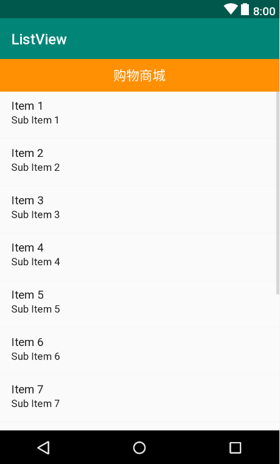

5. 创建列表条目界面的布局文件 list_item.xml，在其中放置1个ImageView用于放置商品图片，再放置2个TextView分别用于显示商品名称和描述信息。

   布局文件示例代码如下：

   ```xml
   <?xml version="1.0" encoding="utf-8"?>
   <RelativeLayout xmlns:android="http://schemas.android.com/apk/res/android"
       android:layout_width="match_parent"
       android:layout_height="match_parent"
       android:padding="10dp">
       <ImageView
           android:id="@+id/iv"
           android:layout_width="120dp"
           android:layout_height="90dp"
           android:src="@drawable/apple"
           android:layout_centerVertical="true"/>
       <RelativeLayout
           android:layout_width="wrap_content"
           android:layout_height="90dp"
           android:layout_marginLeft="10dp"
           android:layout_toRightOf="@id/iv"
           android:layout_centerVertical="true">
           <TextView
               android:id="@+id/tv_title"
               android:layout_width="wrap_content"
               android:layout_height="wrap_content"
               android:textSize="20sp"
               android:textStyle="bold"
               android:text="苹果"/>
           <TextView
               android:id="@+id/tv_price_left"
               android:layout_width="wrap_content"
               android:layout_height="wrap_content"
               android:textSize="20sp"
               android:layout_below="@id/tv_title"
               android:text="价格："/>
           <TextView
               android:id="@+id/tv_price_right"
               android:layout_width="wrap_content"
               android:layout_height="wrap_content"
               android:textSize="20sp"
               android:layout_below="@id/tv_title"
               android:layout_toRightOf="@id/tv_price_left"
               android:text="1000元"/>
       </RelativeLayout>
   </RelativeLayout>
   ```

   效果图如下：

   

6. 在 Activity 中实现购物商城的显示效果。

   在MainActivity.java中创建一个继承自BaseAdapter类的适配器，并在该类中实现对ListView控件的数据适配。示例代码如下：

   ```java
   package cn.itcast.listview;
   
   import android.app.Activity;
   import android.os.Bundle;
   import android.view.View;
   import android.view.ViewGroup;
   import android.widget.BaseAdapter;
   import android.widget.ImageView;
   import android.widget.ListView;
   import android.widget.TextView;
   public class MainActivity extends Activity {
       //商品名称与价格数据集合
       private String[] titles = {"桌子", "苹果", "蛋糕", "线衣", "猕猴桃", "围巾"};
       private String[] prices = {"1800元", "10元/kg", "300元", "350元", "10元/kg",
               "280元"};
       //图片数据集合
       private int[] icons = {R.drawable.table, R.drawable.apple, R.drawable.cake,
               R.drawable.wireclothes, R.drawable.kiwifruit, R.drawable.scarf};
   
       protected void onCreate(Bundle savedInstanceState) {
           super.onCreate(savedInstanceState);
           setContentView(R.layout.activity_main);
           ListView mListView = findViewById(R.id.lv); //初始化ListView控件
           MyBaseAdapter mAdapter = new MyBaseAdapter(); //创建一个Adapter的实例
           mListView.setAdapter(mAdapter);                  //设置Adapter
       }
   
       class MyBaseAdapter extends BaseAdapter {
           @Override
           public int getCount() {   //获取条目的总数
               return titles.length; //返回条目的总数
           }
   
           @Override
           public Object getItem(int position) {
               return null; //返回条目的数据对象
           }
   
           @Override
           public long getItemId(int position) {
               return 0; //返回条目的Id
           }
           //获取条目的视图
           @Override
           public View getView(int position, View convertView, ViewGroup parent) {
               // 加载 list_item.xml 布局文件
               View view = View.inflate(MainActivity.this, R.layout.list_item, null);
               // 获取列表条条目布局中的控件
               ImageView iv_icon = view.findViewById(R.id.iv);
               TextView tv_title = view.findViewById(R.id.tv_title);
               TextView tv_price = view.findViewById(R.id.tv_price_right);
               // 设置控件内容
               iv_icon.setImageResource(icons[position]);
               tv_title.setText(titles[position]);
               tv_price.setText(prices[position]);
               return view;
           }
       }
   }
   ```

7. 运行程序。

   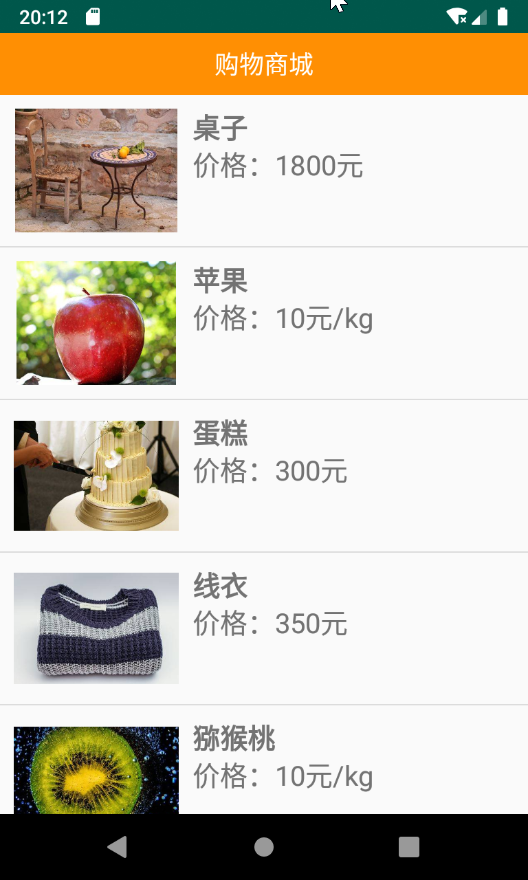


#### 3.2.1.4 优化ListView

当ListView中加载的Item过多，并快速滑动列表控件时，会出现界面卡顿的现象。出现这种问题的原因是，在滑动屏幕时，getView()方法中的存在以下两个问题：（1）不断创建Item对象；（2）不断执行findViewById()方法初始化控件。

优化方法：使用ViewHolder类缓存控件实例。

优化getView()方法的具体代码如下：

```java
public class MainActivity extends AppCompatActivity {

    // ...

    class MyAdapter extends BaseAdapter{

        // ...

        @Override
        public View getView(int position, View convertView, ViewGroup parent) {
            ViewHolder holder = null;
            // 判断滑出屏幕的Item对象是否为空
            if (convertView == null){
                // 将list_item.xml文件加载为view对象
                convertView = View.inflate(MainActivity.this, R.layout.list_item,
                        null);
                // 获取列表条目布局界面中的控件
                holder =  new ViewHolder();
                holder.iv_icon = convertView.findViewById(R.id.iv);
                holder.tv_title = convertView.findViewById(R.id.tv_title);
                holder.tv_price = convertView.findViewById(R.id.tv_price_right);
                // 将holder对象缓存到convertView中
                convertView.setTag(holder);
            }
            else{
                // 从convertView中获取缓存的holder对象
                holder = (ViewHolder) convertView.getTag();
            }
            // 设置列表布局界面中控件的内容
            holder.iv_icon.setImageResource(icons[position]);
            holder.tv_title.setText(titles[position]);
            holder.tv_price.setText(prices[position]);
            return convertView;
        }
    }

    // 创建ViewHolder类，放置需要加载的控件变量
    class ViewHolder{
        TextView tv_title, tv_price;
        ImageView iv_icon;
    }
}
```

### 3.2.2 RecyclerView控件

在Android 5.0后，Google公司提供一个功能更加强大的列表控件：RecyclerView。

#### 3.2.2.1 控件功能

|            | RecyclerView控件                                     | ListView控件                                      |
| ---------- | ---------------------------------------------------- | ------------------------------------------------- |
| 展示效果   | 实现横向或竖向的列表效果、瀑布流效果和GridView效果   | 只能实现竖直的列表效果                            |
| 数据适配器 | 使用RecyclerView.Adapter适配器；强制使用ViewHolder类 |                                                   |
| 复用效果   | 复用Item对象的工作由控件实现                         | 开发者通过convertView的setTag()和getTag()方法实现 |
| 动画效果   | 通过setItemAnimator()方法为Item添加动画效果          | 没有setItemAnimator()方法                         |

#### 3.2.2.2 使用示例

1. 新建模块 RecyclerView，在该模块的build.gradle文件的dependencies{}节点中添加recyclerview-v7库。

   **注意：添加的recyclerview-v7库的版本需要与com.android.support:appcompat库的版本一致。**

   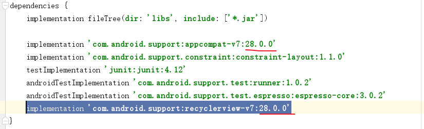

2. 复制 listview 模块中的图片和列表条目布局文件到该模块中。

3. 新建布局文件 shopping_rv.xml，并在其中添加1个RecyclerView控件。示例代码如下：

   ```xml
   <?xml version="1.0" encoding="utf-8"?>
   <LinearLayout xmlns:android="http://schemas.android.com/apk/res/android"
       android:layout_width="match_parent"
       android:layout_height="match_parent">
       
       <android.support.v7.widget.RecyclerView
           android:id="@+id/id_rv"
           android:layout_width="match_parent"
           android:layout_height="match_parent">        
       </android.support.v7.widget.RecyclerView>
   
   </LinearLayout>
   ```

   预览效果图如下：

   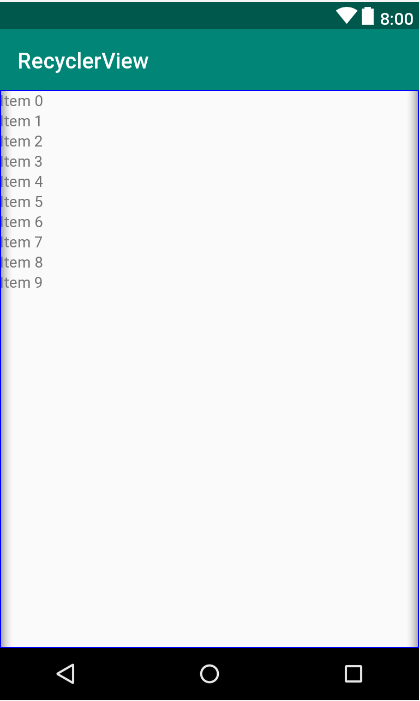

4. 在MainActivity中实现商品列表界面的显示效果。

   （1）从listview模块中复制列表数据；

   （2）创建数据适配器类继承RecyclerView.Adapter。先在该类中创建内部类MyViewHolder，再重写RecyclerView.Adapter中的三个方法。

   示例代码如下：

   ```java
   package cn.itcast.recyclerview;
   
   import android.support.annotation.NonNull;
   import android.support.v7.app.AppCompatActivity;
   import android.os.Bundle;
   import android.support.v7.widget.LinearLayoutManager;
   import android.support.v7.widget.RecyclerView;
   import android.view.LayoutInflater;
   import android.view.View;
   import android.view.ViewGroup;
   import android.widget.ImageView;
   import android.widget.LinearLayout;
   import android.widget.TextView;
   
   public class MainActivity extends AppCompatActivity {
   
       private String[] titles = {"桌子", "苹果", "蛋糕", "线衣", "猕猴桃", "围巾"};
       private String[] prices = {"1800元", "10元/kg", "300元", "350元", "10元/kg", "280元"};
       private int[] icons = {R.drawable.table, R.drawable.apple, R.drawable.cake,
               R.drawable.wireclothes, R.drawable.kiwifruit, R.drawable.scarf};
   
       @Override
       protected void onCreate(Bundle savedInstanceState) {
           super.onCreate(savedInstanceState);
           setContentView(R.layout.shopping_rv);
   
           // 获取RecyclerView控件
           RecyclerView recyclerView = findViewById(R.id.id_rv);
           // 设置RecyclerView控件的显示方式为线性垂直
           recyclerView.setLayoutManager(new LinearLayoutManager(this));
           // 设置数据适配器
           HomeAdapter homeAdapter = new HomeAdapter();
           recyclerView.setAdapter(homeAdapter);
       }
   
       // 创建数据适配器
       class HomeAdapter extends RecyclerView.Adapter<HomeAdapter.MyViewHolder>{
   
           @NonNull
           @Override
           public MyViewHolder onCreateViewHolder(@NonNull ViewGroup viewGroup, int i) {
               // 加载Item界面的布局文件，并返回MyViewHolder类的对象
               MyViewHolder holder = new MyViewHolder(LayoutInflater.from(MainActivity.this).
                       inflate(R.layout.list_item, viewGroup, false));
               return holder;
           }
   
           @Override
           public void onBindViewHolder(@NonNull MyViewHolder myViewHolder, int i) {
               // 将获取的数据设置到对应的控件上
               myViewHolder.tv_title.setText(titles[i]);
               myViewHolder.tv_price.setText(prices[i]);
               myViewHolder.iv_icon.setImageResource(icons[i]);
           }
   
           @Override
           public int getItemCount() {
               // 获取列表条目总数
               return titles.length;
           }
   
           // 创建一个MyViewHolder类继承RecyclerView.ViewHolder类，在该类中获取界面上的控件
           class MyViewHolder extends RecyclerView.ViewHolder{
   
               TextView tv_title, tv_price;
               ImageView iv_icon;
   
               MyViewHolder(@NonNull View itemView) {
                   super(itemView);
                   tv_title = itemView.findViewById(R.id.tv_name);
                   tv_price = itemView.findViewById(R.id.tv_price_right);
                   iv_icon = itemView.findViewById(R.id.id_rv);
               }
           }
       }
   }
   ```

5. 运行程序。

   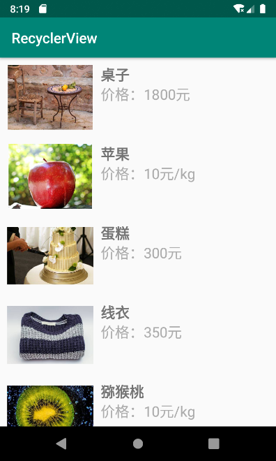
