# 第4章 程序活动单元Activity

## 4.1 Activity的生命周期

### 4.1.2 生命周期方法

创建一个名为ActivityBasic的应用程序。在程序中的MainActivity中重写Activity的生命周期方法，通过打印日志观察生命周期方法的调用过程。

```java
package cn.itcast.activitybasic;

import android.support.v7.app.AppCompatActivity;
import android.os.Bundle;
import android.util.Log;

public class MainActivity extends AppCompatActivity {

    @Override
    protected void onCreate(Bundle savedInstanceState) {
        super.onCreate(savedInstanceState);
        setContentView(R.layout.activity_main);
        Log.i("ActivityBasic", "MainActivity onCreate()");
    }

    @Override
    protected void onStart() {
        super.onStart();
        Log.i("ActivityBasic", "MainActivity onStart()");
    }

    @Override
    protected void onRestart() {
        super.onRestart();
        Log.i("ActivityBasic", "MainActivity onRestart()");
    }

    @Override
    protected void onStop() {
        super.onStop();
        Log.i("ActivityBasic", "MainActivity onStop()");
    }

    @Override
    protected void onDestroy() {
        super.onDestroy();
        Log.i("ActivityBasic", "MainActivity onDestroy()");
    }

    @Override
    protected void onPause() {
        super.onPause();
        Log.i("ActivityBasic", "MainActivity onPause()");
    }

    @Override
    protected void onResume() {
        super.onResume();
        Log.i("ActivityBasic", "MainActivity onResume()");
    }

}
```

启动应用，打印出的日志信息：

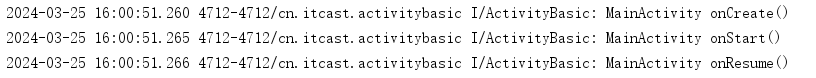

按Home键后，当前应用切换到后台，打印出的日志信息：

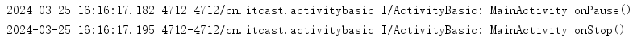

按Home键后重新打开应用，当前应用切换回前台，日志信息：

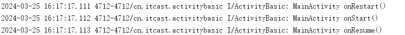

按返回键，当前应用结束运行，日志信息：

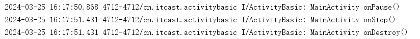

## 4.2 Activity的创建、配置、启动和关闭

### 4.2.1 创建Activity

在ActivityBasic程序中，使用【New】→【Activity】→【Empty Activity】的方式，创建一个名为ActivityExample的Activity。

在ActivityExample中重写生命周期方法，使用Log.i()方法打印这些方法的调用情况。

### 4.2.3 启动和关闭Activity

1. 启动Activity

   在MainActivity的布局文件中，添加1个TextView控件用于显示当前Activity的名称，添加1个Button控件用于启动ActivityExample。

   启动ActivityExample的代码如下：

   ```java
   Intent intent = new Intent(MainActivity.this, ActivityExample.class);
   startActivity(intent);
   ```

2. 关闭Activity

   在ActivityExample的布局文件中，添加1个TextView控件用于显示当前Activity的名称，添加1个Button控件用于关闭当前Activity。

   关闭Activity的代码如下：

   ```java
   finish();
   ```

​	==启动和关闭Activity时，注意观察Logcat中的日志信息。==

### 4.2.2 配置Activity

在ActivityBasic程序中，使用【New】→【Java class】的方式，创建一个SecondActivity类，并使该类继承android.app.Activity。

在MainActivity的布局文件中，再添加1个Button控件用于启动SecondActivity。

此时直接在MainActivity中启动SecondActivity，日志窗口中可观察到抛出了ActivityNotFound异常，提示需要在AndroidManifest.xml文件中进行配置。

配置的方法为，在AndroidManifest.xml文件中的`<application>`标签中添加一个`<activity>`标签。具体代码如下：

```xml
<activity android:name="cn.itcast.activitybasic.SecondActivity"></activity>
```

`<activity>`标签的android:name属性为Activity的java类名，如果Activity的包名与清单文件中`<manifest>`标签的package属性相同则可以省略包名，配置为：

```xml
<activity android:name=".SecondActivity"></activity>
```

## 4.3 Intent与IntentFilter

使用隐式Intent在不同程序之间进行消息传递时，Android可以根据intent的属性值匹配并启动目标组件。

### 4.3.1 action属性

Intent的Action属性的值是一个普通的字符串，代表该Intent所要完成的一个抽象动作。

一个过滤规则(intentFilter)可以有多个action。一个IntentFilter**必须**有一个action，如果没有那么则匹配失败。多个action只要匹配成功一个即可匹配成功。

**使用案例：**

ActivityBasic程序中新建一个名为app2的Module，在app2中新建一个名为Activity1的Activity。

如果要在app的MainActivity中启动app2的Activity1。==注意：app2要先安装到模拟器上。==

首先需要在app2的清单文件中，为目标组件（Activity1）的IntentFilter配置action属性。具体代码如下：

```xml
<activity android:name=".Activity2">
    <intent-filter>
        <action android:name="android.intent.action.START_ACTIVITY" />

        <category android:name="android.intent.category.DEFAULT" />
    </intent-filter>
</activity>
```

然后在app的MainActivity中设置intent的action属性，具体代码如下：

```java
Intent intent = new Intent();
intent.setAction("android.intent.action.START_ACTIVITY");
startActivity(intent);
```

==注意：使用隐式Intent开启Activity时，系统会默认为该intent添加值为"android.intent.category.DEFAULT"的category属性，因此目标组件的`<intent-filter/>`中需要有`<category android:name="android.intent.category.DEFAULT" />`这个配置。==

### 4.3.3 category属性

category是一个字符串，Intent可以没有category，但是如果一旦有category，不管有几个，每一个都要能够和过滤规则中的任何一个category相同。简而言之，Intent中携带Category要全部能和IntentFilter中的Category匹配。

**使用案例：**

在app2的清单文件中，为目标组件（Activity1）的IntentFilter增加category属性。==注意：修改完清单文件后，需要重新将应用运行到模拟器上。==

具体代码如下：

```xml
<activity android:name=".Activity2">
    <intent-filter>
        <action android:name="cn.itcast.START_ACTIVITY" />

        <category android:name="android.intent.category.DEFAULT" />
        <category android:name="it.cast.TESTCATEGORY" />
    </intent-filter>
</activity>
```

然后在app的MainActivity中为intent增加category属性，具体代码如下：

```java
Intent intent = new Intent();
intent.setAction("android.intent.action.START_ACTIVITY");
intent.addCategory("it.cast.TESTCATEGORY");
startActivity(intent);
```

### 4.3.2 data属性

Data属性一般由mimeType和URI两部分组成，通常用来为Action提供操作的数据，也就是说Action负责跳转到指定的组件，Data就可以提供数据给跳转到的组件。

**使用案例：**

1. 调用系统浏览器 

   首先指定Intent的action为“Intent.ACTION_VIEW”，这是一个android系统的内置动作，其常量值为android.intent.action.VIEW。然后通过Uri.parse()方法，将一个网址字符串解析成一个Uri对象。最后调用Intent的setData()方法将这个Uri对象传递进去。

   ```java
   Intent intent = new Intent(Intent.ACTION_VIEW);
   intent.setData(Uri.parse("http://www.baidu.com"));
   startActivity(intent);
   ```

2. 调用拨号界面

   首先指定Intent的action为“Intent.ACTION_DIAL”，这又是一个android系统的内置动作，然后在data部分指定协议为tel，号码为10086。

   ```java
   Intent intent = new Intent(Intent.ACTION_DIAL);
   intent.setData(Uri.parse("tel:10086"));
   startActivity(intent);
   ```

3. 拨打电话

   和Intent调用拨号盘一样，也是setAction()，然后setData()，只是Action，替换为“Intent.ACTION_CALL”。注意：使用“Intent.ACTION_CALL”是，需要在AndroidManifest.xml文件中添加拨号权限。

   申请权限：

   ```xml
   <uses-permission android:name="android.permission.CALL_PHONE" />
   ```

   代码：

   ```java
   Intent intent = new Intent(Intent.ACTION_CALL);
   intent.setData(Uri.parse("tel:10086"));
   startActivity(intent);
   ```

4. 发送短信

    发送短信和拨打电话是一样的，只是Action和需要申请的权限不同。直接发送短信的Action为：Intent.ACTION_SENDTO。同时要需要调用putExtra()方法添加短信内容。

   ```java
   Intent intent = new Intent(Intent.ACTION_SENDTO);
   // 匹配目标组件
   intent.setData(Uri.parse("smsto:10086"));
   // 添加附加数据
   //sms_body固定参数，代表短信内容
   //发送短信内容为："《致命魔术》贼好看。"
   intent.putExtra("sms_body","《致命魔术》贼好看。");
   startActivity(intent);
   ```

参考资料：

1. [Intent 属性详解（上） - 知乎](https://zhuanlan.zhihu.com/p/30258725)、[Intent 属性详解（下） - 知乎](https://zhuanlan.zhihu.com/p/30293165)
2. [Android中Intent-filter的四个属性Action，Category，Extras，Data - 博客园](https://www.cnblogs.com/aademeng/articles/11023803.html)
3. [MIME 类型 | 菜鸟教程 (runoob.com)](https://www.runoob.com/http/mime-types.html)
4. [Android Intent常用方法详细介绍，显示Intent，隐式Intent，调用浏览器，拨号，发短信，传递数据_intent.action_view-CSDN博客](https://blog.csdn.net/zhaohuiyang_949/article/details/86305221)
5. [permission 和 user-permission的区别-CSDN博客](https://blog.csdn.net/mattdong0106/article/details/51769168#:~:text=user-permission ,1 2 如果应用需要访问受权限保护的功能，则必须在清单文件中使用 元素声明应用需要该权限。 但是，将应用安装到设备上之后，安装程序会通过检查签署应用证书的颁发机构并（在某些情况下）询问用户，确定是否授予请求的权限。 如果授予权限，则应用能够使用受保护的功能。)
6. [Android: Intent匹配及mimeType匹配，这一篇就够了！！ - 简书 (jianshu.com)](https://www.jianshu.com/p/3ed09a419e9e)

## 4.4 Avtivity之间的跳转

### 4.4.1 Activity之间的数据传递

==注意区分setData()与putExtra()方法==：setData，传入的是Uri，用于数据的过滤。 setData可以被系统用来寻找匹配目标组件。 putExtra 只是用来设定各种不同类型的附加数据。 不被系统用来寻找匹配目标组件。

1. MainActivity 和 SecondActivity 的布局文件代码

   MainActivity 的布局文件中添加一个 TextView 用于显示当前Activity名称，添加一个 Button 用于跳转到 SecondActivity。具体代码如下：

   ```xml
   <?xml version="1.0" encoding="utf-8"?>
   <LinearLayout xmlns:android="http://schemas.android.com/apk/res/android"
       android:layout_width="match_parent"
       android:layout_height="match_parent"
       android:orientation="vertical">
   
       <TextView
           android:layout_width="match_parent"
           android:layout_height="wrap_content"
           android:text="MainActivity"
           android:textSize="20sp"
           android:gravity="center"/>
       <Button
           android:layout_width="match_parent"
           android:layout_height="wrap_content"
           android:text="向SecondActivity传递数据"
           android:onClick="click"/>
   </LinearLayout>
   ```

   SecondAvtivity  的布局文件中添加一个 TextView 用于显示当前Activity名称。具体代码如下：

   ```xml
   <?xml version="1.0" encoding="utf-8"?>
   <LinearLayout xmlns:android="http://schemas.android.com/apk/res/android"
       android:layout_width="match_parent"
       android:layout_height="match_parent">
   
       <TextView
           android:layout_width="match_parent"
           android:layout_height="wrap_content"
           android:text="SecondActivity"
           android:textSize="20sp"
           android:gravity="center"/>
   
   </LinearLayout>
   ```

2. MainActivity 和 SecondActivity 的 Java 代码

   在 MainActivity 中将自己的姓名、年龄和性别信息传递到 SecondActivity，具体代码如下：

   ```java
   public class MainActivity extends AppCompatActivity {
   
       @Override
       protected void onCreate(Bundle savedInstanceState) {
           super.onCreate(savedInstanceState);
           setContentView(R.layout.activity_main);
       }
   
       void click(View view){
           Intent intent = new Intent(MainActivity.this, SecondActivity.class);
           intent.putExtra("姓名", "莉莉");
           intent.putExtra("年龄", 18);
           intent.putExtra("是女生吗？", true);
           startActivity(intent);
       }
   }
   
   ```

   在 SecondActivity 中接收 MainActivity  传递过来的数据，并使用 Toast 类进行显示。具体代码如下：

   ```java
   public class SecondActivity extends AppCompatActivity {
   
       @Override
       protected void onCreate(Bundle savedInstanceState) {
           super.onCreate(savedInstanceState);
           setContentView(R.layout.activity_second);
   
           Intent intent = getIntent();
           String name = intent.getStringExtra("姓名");
           int age = intent.getIntExtra("年龄", 18);
           boolean isGril = intent.getBooleanExtra("是女生吗？", true);
           Toast.makeText(SecondActivity.this,
                   "姓名："+name+"，年龄："+age+"，是女生吗？"+isGril,
                   Toast.LENGTH_LONG).show();
       }
   }
   ```

​	

### 4.4.2 Activity之间的数据回传

1. MainActivity和SecondActivity的布局代码

   MainActivity 的布局文件中添加一个 TextView 用于显示当前Activity名称，添加一个 Button 用于获取位置信息。具体代码如下：

   ```xml
   <?xml version="1.0" encoding="utf-8"?>
   <LinearLayout xmlns:android="http://schemas.android.com/apk/res/android"
       android:layout_width="match_parent"
       android:layout_height="match_parent"
       android:orientation="vertical">
   
       <TextView
           android:layout_width="match_parent"
           android:layout_height="wrap_content"
           android:text="MainActivity"
           android:textSize="20sp"
           android:gravity="center"/>
       <Button
           android:layout_width="match_parent"
           android:layout_height="wrap_content"
           android:text="获取位置信息"
           android:onClick="click"/>
   
   </LinearLayout>
   ```

   

   SecondAvtivity 的布局文件中添加一个 TextView 用于显示当前Activity名称，添加一个 Button 用于返回位置信息。具体代码如下：

   ```xml 
   <?xml version="1.0" encoding="utf-8"?>
   <LinearLayout xmlns:android="http://schemas.android.com/apk/res/android"
       android:layout_width="match_parent"
       android:layout_height="match_parent"
       android:orientation="vertical">
   
       <TextView
           android:layout_width="match_parent"
           android:layout_height="wrap_content"
           android:text="SecondActivity"
           android:textSize="20sp"
           android:gravity="center"/>
       <Button
           android:layout_width="match_parent"
           android:layout_height="wrap_content"
           android:text="返回位置信息"
           android:onClick="click"/>
   
   </LinearLayout>
   ```

   

2. MainActivity 和 SecondActivity 的Java代码

   MainActivity 中开启 SecondActivity，并接收 SecondActivity 回传的数据， 回传的数据使用 Toast 类进行显示。具体代码如下： 

   ```java
   public class MainActivity extends AppCompatActivity {
   
       @Override
       protected void onCreate(Bundle savedInstanceState) {
           super.onCreate(savedInstanceState);
           setContentView(R.layout.activity_main);
       }
       
       void click(View v){
           Intent intent = new Intent(MainActivity.this, SecondActivity.class);
           startActivityForResult(intent, 1);
       }
   
       @Override
       protected void onActivityResult(int requestCode, int resultCode, Intent data) {
           super.onActivityResult(requestCode, resultCode, data);
           if (requestCode==1 && resultCode==2){
               String acquireData = data.getStringExtra("位置");
               Toast.makeText(MainActivity.this, "当前位置："+acquireData, 
                       Toast.LENGTH_LONG).show();
           }
       }      
   }
   ```

   

   在 SecondActivity 中将当前位置回传到 MainActivity 。具体代码如下：

   ```java
   public class SecondActivity extends AppCompatActivity {
   
       @Override
       protected void onCreate(Bundle savedInstanceState) {
           super.onCreate(savedInstanceState);
           setContentView(R.layout.activity_second);
       }
   
       void click(View v){
           Intent intent = new Intent();
           intent.putExtra("位置", "新乡工程学院");
           setResult(2, intent);
           finish();
       }
   }
   ```

   


参考资料：

1. [Android开发中Intent类的putExtra和setData 区别_android intent.setdata intent.put-CSDN博客](https://blog.csdn.net/lovewlforever/article/details/35226185)

## 4.5 任务栈和启动模式

### 4.5.1 任务栈

Android对Activity的管理方式如下图所示。Android中使用任务栈（TaskRecord）对Activity进行存储和管理。每个应用可以启动多个任务栈，这些任务栈由当前应用的活动栈（ActivityStack）来进行管理的。一般每个应用对应一个ActivityStack，在不同的显示设备中，当前显示的Activity对应的任务栈为前台栈，其他任务栈都是后台栈。Android支持主屏幕、外接屏幕和虚拟屏幕三种显示设备，一般在手机上只有主屏幕，不同设备中显示的应用也以栈的方式进行管理。

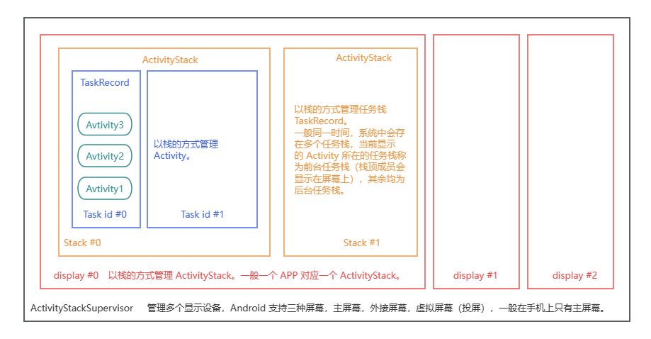

使用adb命令（在SDK安装路径下的\platform-tools目录中）可以打印任务栈信息。Android11以下搜索关键字：Running activities。

```shell
adb shell dumpsys activity activities
```

例如，启动模拟器后，打印任务栈信息，精简后的信息如下：

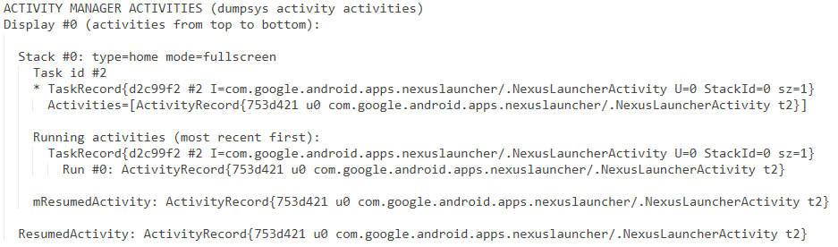

从以上信息中可分析出，当前在0号显示器（Display #0）中有一个0号活动栈（Stack #0）， 0号活动栈中有一个2号任务栈（Task id #2），2号任务栈中有一个Activity正在运行，即`com.google.android.apps.nexuslauncher`这个包下的`NexusLauncherActivity`，这是Android 系统的桌面（启动器），可以启动其他应用程序。此时2号任务栈为前台栈。

接着，在模拟器的桌面启动拨号应用，观察任务栈的变化。

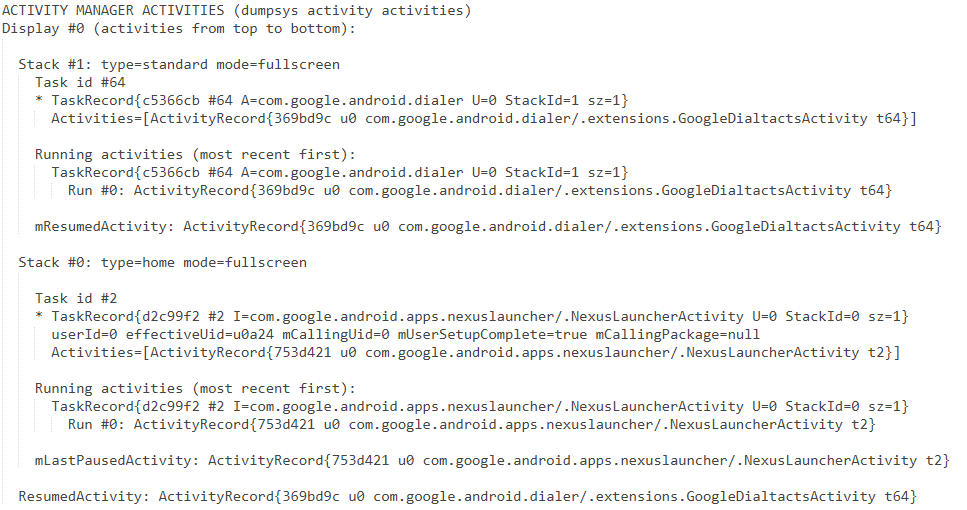

此时，0号显示器中有了2个活动栈，1号活动栈中中一个id为64的任务栈，64号任务栈运行了一个Activity，即`com.google.android.dialer`包下的`extensions.GoogleDialtactsActivity`，这就是刚刚启动的拨号应用。此时64号任务栈为前台栈。

参考资料：

1. [Android AMS 完全剖析1 —— Activity 管理之任务与返回栈 (qq.com)](https://mp.weixin.qq.com/s/xUhlhsNrqx0ClywRBUAEkQ)

### 4.5.2 启动模式

#### 1、standard模式（默认模式）

**特点：**

每启动一个Activity，就会在栈顶创建一个新的实例。

**实验验证：**

创建3个Activity。在每个Activity的`onCreate()`方法和`onDestory()`函数中打印日志，记录每个实例的创建顺序。

```xml
<activity android:name=".Activity1">
    <intent-filter>
        <action android:name="android.intent.action.MAIN" />

        <category android:name="android.intent.category.LAUNCHER" />
    </intent-filter>
</activity>
<activity android:name=".Activity2" />
<activity android:name=".Activity3"></activity>
```

在代码中设置如下跳转顺序：Activity1->Activity2->Activity3->Activity1。

```java
package cn.itcast.standard;

import android.content.Intent;
import android.support.v7.app.AppCompatActivity;
import android.os.Bundle;
import android.util.Log;
import android.view.View;
import android.widget.Button;

public class Activity1 extends AppCompatActivity {

    @Override
    protected void onCreate(Bundle savedInstanceState) {
        super.onCreate(savedInstanceState);
        setContentView(R.layout.activity_test1);
        Log.i("standard", "Create " + Activity1.this.toString());

        Button btn = findViewById(R.id.btn_1);
        btn.setOnClickListener(new View.OnClickListener() {
            @Override
            public void onClick(View v) {
                Intent intent = new Intent(Activity1.this, Activity2.class);
                startActivity(intent);
            }
        });
    }

    @Override
    protected void onDestroy() {
        super.onDestroy();
        Log.i("standard", "Destroy " + Activity1.this.toString());
    }
}
```

运行程序，依次执行跳转操作，打印任务栈信息如下：

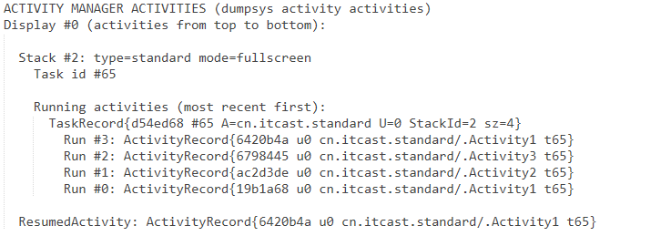

然后一直按返回键，直到退出应用。Logcat窗口输出的日志信息如下：

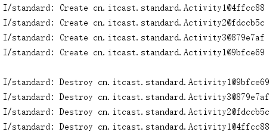

#### 2、SingleInstance模式

**特点：**

指定SingleInstance模式的Activity会启动一个新任务栈来管理该Activity实例。如果要启动的Activity实例在任务栈中不存在，系统会新建一个任务栈压入该实例；否则，系统会把该Activity实例所在任务栈移到前台，从而显示该Activity。

**实验验证：**

创建3个Activity，设置Activity2的启动模式为singleInstance。

```xml
<activity android:name=".Activity1">
    <intent-filter>
        <action android:name="android.intent.action.MAIN" />

        <category android:name="android.intent.category.LAUNCHER" />
    </intent-filter>
</activity>
<activity android:name=".Activity2" android:launchMode="singleInstance"/>
<activity android:name=".Activity3"></activity>
```

重写Activity2的生命周期函数，并在每个方法中打印日志信息，观察具体的调用情况。

```java
package cn.itcast.singleinstance;

import android.content.Intent;
import android.support.v7.app.AppCompatActivity;
import android.os.Bundle;
import android.util.Log;
import android.view.View;
import android.widget.Button;

public class Activity2 extends AppCompatActivity {

    @Override
    protected void onCreate(Bundle savedInstanceState) {
        super.onCreate(savedInstanceState);
        setContentView(R.layout.activity_2);
        Log.i("singleInstance", "Create " + Activity2.this.toString());

        Button btn = findViewById(R.id.si_btn_2);
        btn.setOnClickListener(new View.OnClickListener() {
            @Override
            public void onClick(View v) {
                Intent intent = new Intent(Activity2.this, Activity3.class);
                startActivity(intent);
            }
        });
    }

    @Override
    protected void onDestroy() {
        super.onDestroy();
        Log.i("singleInstance", "Destroy " + Activity2.this.toString());
    }

    @Override
    protected void onRestart() {
        super.onRestart();
        Log.i("singleInstance", "Restart " + Activity2.this.toString());
    }
}
```

在代码中设置如下跳转顺序：Activity1->Activity2->Activity3->Activity1->Activity2->Activity3。

运行程序，依次执行跳转操作，观察任务栈信息。

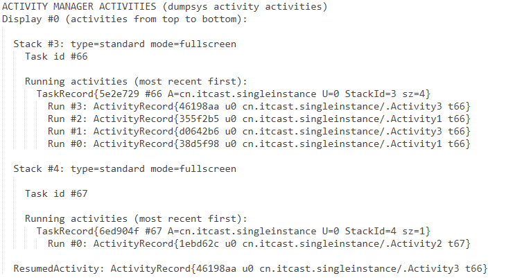

然后一直按返回键，直到退出应用。Logcat窗口中打印的日志信息如下：

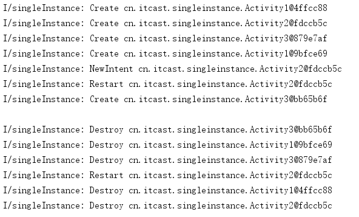

**总结：**

`OnNewIntent()`只对`SingleTop`(且位于栈顶)，`SingleTask`和`SingleInstance`(且已经在任务栈中存在实例)的情况下，再次启动它们时才会调用，即==只对startActivity有效==，对仅仅从后台切换到前台而不再次启动的情形，不会触发onNewIntent。

从任务栈信息中可分析出，启动方式为SingleInstance时，启动该Activity不仅会创建新任务栈，还会创建新活动栈管理此任务栈。

#### 3、singleTop模式

**特点：**

如果要启动的Activity已经在栈顶，则直接进行复用，并且通过onNewIntent方法进行通知；否则创建新的实例。

**实验验证：**

创建3个Activity，设置Activity3的启动模式为singleInstance。在每个Activity的`onCreate()`方法和`onDestory()`函数中打印日志，记录每个实例的创建顺序。

设计两组实验，对比给Activity2设置singleTop模式前后的运行结果。

**实验一：**Activity2使用默认启动模式。

```xml
<activity android:name=".Activity1">
    <intent-filter>
        <action android:name="android.intent.action.MAIN" />

        <category android:name="android.intent.category.LAUNCHER" />
    </intent-filter>
</activity>
<activity android:name=".Activity2"/>
<activity android:name=".Activity3" android:launchMode="singleInstance"></activity>
```

在代码中设置如下跳转顺序：Activity1->Activity2->Activity3->Activity2。

运行程序，依次执行跳转操作，观察任务栈信息。

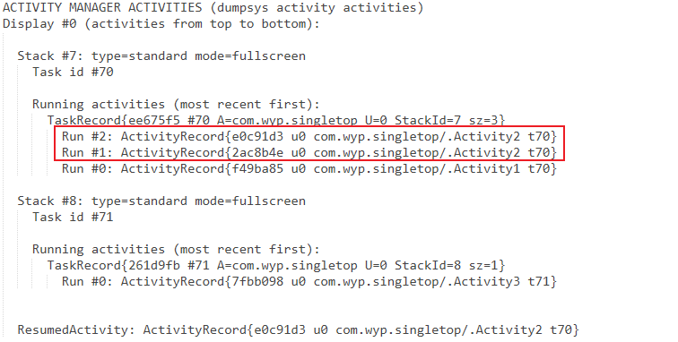

然后一直按返回键，直到退出应用。Logcat窗口中打印的日志信息如下：

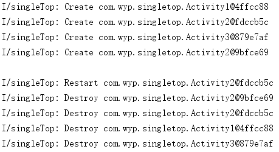

**实验二：**==Activity2启动模式设置为singleTop==。

```xml
<activity android:name=".Activity1">
    <intent-filter>
        <action android:name="android.intent.action.MAIN" />

        <category android:name="android.intent.category.LAUNCHER" />
    </intent-filter>
</activity>
<activity android:name=".Activity2" android:launchMode="singleTop"/>
<activity android:name=".Activity3" android:launchMode="singleInstance"></activity>
```

在代码中设置如下跳转顺序：Activity1->Activity2->Activity3->Activity2。

运行程序，依次执行跳转操作，观察任务栈信息。

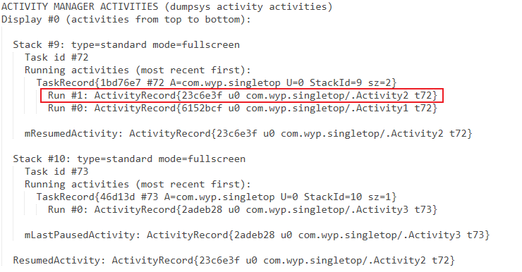

然后一直按返回键，直到退出应用。Logcat窗口中打印的日志信息如下：

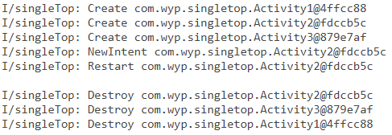

#### 4、singleTask模式

**特点：**

如果要启动的Activity已经在栈中，则把当前实例上面的示例全部出栈，从而让该实例展示到前台；否则创建新的实例。

**实验验证：**

创建3个Activity，设置Activity3的启动模式为singleInstance。在每个Activity的`onCreate()`方法和`onDestory()`函数中打印日志，记录每个实例的创建顺序。

设计两组实验，对比给Activity2设置singleTask模式前后的运行结果。

**实验一：**Activity1使用默认启动模式。

```xml
<activity android:name=".Activity1">
    <intent-filter>
        <action android:name="android.intent.action.MAIN" />

        <category android:name="android.intent.category.LAUNCHER" />
    </intent-filter>
</activity>
<activity android:name=".Activity2"/>
<activity android:name=".Activity3" android:launchMode="singleInstance"></activity>
```

在代码中设置如下跳转顺序：Activity1->Activity2->Activity3->Activity1。

运行程序，依次执行跳转操作，观察任务栈信息。

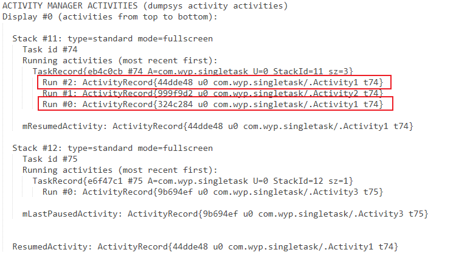

然后一直按返回键，直到退出应用。Logcat窗口中打印的日志信息如下：

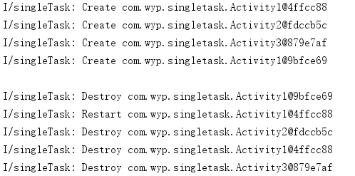

**实验二**：==Activity1启动模式设置为SingleTask==。

```xml
<activity android:name=".Activity1" android:launchMode="singleTask">
    <intent-filter>
        <action android:name="android.intent.action.MAIN" />

        <category android:name="android.intent.category.LAUNCHER" />
    </intent-filter>
</activity>
<activity android:name=".Activity2" />
<activity android:name=".Activity3" android:launchMode="singleInstance"></activity>
```

在代码中设置如下跳转顺序：Activity1->Activity2->Activity3->Activity1。

运行程序，依次执行跳转操作，观察任务栈信息。

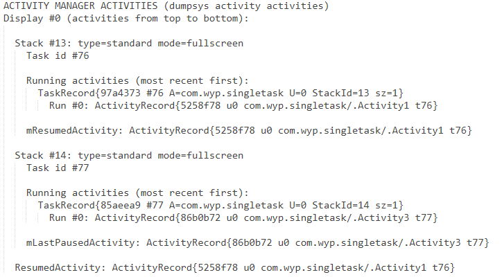

然后一直按返回键，直到退出应用。Logcat窗口中打印的日志信息如下：

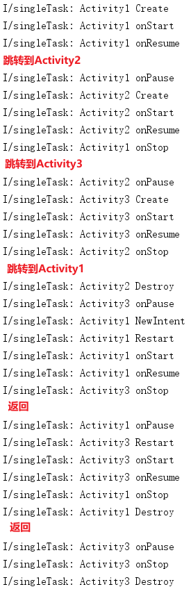

**总结：**

启动应用时，创建76号任务栈，并将Activity1入栈。开启Activity2时，activity2会被压入到当前栈中。开启Activity3时，由于Activity3的启动模式为SingleInstance，因此会新建一个任务栈（77号），并将该实例压入新栈。再次开启Activity1时，由于Activity1的启动模式为SingleTask，此时位于76号栈栈顶的Activity2会先被弹出栈，然后直接取出Activity1的实例继续运行。

参考资料：

1. [Activity的5种启动模式详解(新增singleInstancePerTask类型)-CSDN博客](https://blog.csdn.net/rzleilei/article/details/128799630)
2. [onNewIntent详解-CSDN博客](https://blog.csdn.net/i_nclude/article/details/105472751)

## 4.6 使用Fragment

### 4.6.2 Fragment的生命周期

Fragment不能独立存在，必须嵌入到Activity中使用，所以Fragment生命周期直接受所在的Activity影响。

- 当在Activity中创建Fragment时，Fragment处于启动状态；
- 当Activity被暂停时，其中的所有Fragment也被暂停；
- 当Activity被销毁时，所有在该Activity中的Fragment也被销毁。
- 当一个Activity处于运行状态时，可以单独地对每一个Fragment进行操作，如添加或删除，当添加时，Fragment处于启动状态。当删除时，Fragment处于销毁状态。

### 4.6.3 创建Fragment

**方法一：**

在项目目录结构窗口中右键，依次选择【New】→【Fragment】→【Fragment (blank)】选项。然后在打开的Configure Component窗口中，填写Fragment Name和Fragment Layout Name，并取消勾选【Include fragment factory methods? 】和【Include interface callbacks?】。再点击【finish】按钮完成创建。

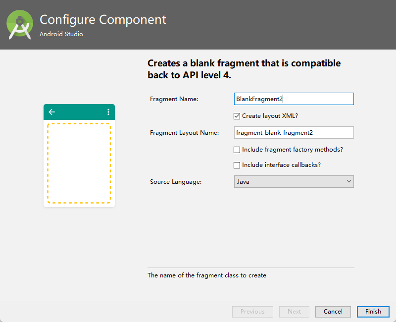

**方法二：**

1. 在选定包名上右键，选择【New】→【Java class】创建一个Java类继承自android.support.v4.app.Fragment。

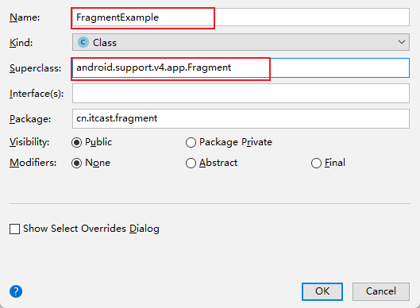

2. 创建相应的布局文件fragment_example.xml 。

3. 重写 FragmentExample 的 onCreateView() 方法，并在其中加载布局 fragment_example.xml。

   ```java
   public class FragmentExample extends Fragment {
      
       @Override
       public View onCreateView(LayoutInflater inflater, ViewGroup container, Bundle savedInstanceState) {
           View v = inflater.inflate(R.layout.fragment_example, container, false);
           return v;
       }
   }
   ```


### 4.6.4 在Activity中添加Fragment

**方法一：静态添加（在Activity的布局文件中添加）**

使用`<fragment/>`标签进行添加。必须指定 id 属性，如果不指定 id 属性，程序运行时会闪退。name属性也必须指定，属性值为 Fragment 全路径。

如果想要预览 Fragment，需要使用 `tools:layout="@layout/fragment_blank"` 指定想要预览的布局，使用该属性前还需要在当前布局文件中添加对应的名称空间`xmlns:tools="http://schemas.android.com/tools"`。==注意：预览图中的布局并非最终运行的布局，运行时的布局根据 `android:name`的值动态加载。==

```xml
<?xml version="1.0" encoding="utf-8"?>
<LinearLayout xmlns:android="http://schemas.android.com/apk/res/android"
    xmlns:tools="http://schemas.android.com/tools"
    android:layout_width="match_parent"
    android:layout_height="match_parent">

    <fragment
        android:id="@+id/fragment_1"
        android:name="cn.itcast.fragment.BlankFragment"
        android:layout_width="match_parent"
        android:layout_height="match_parent"
        tools:layout="@layout/fragment_blank"/>

</LinearLayout>
```


**方法二：动态添加（在Activity的Java代码中加载）** 

获取 FragmentManager 时，如果使用 android.app 包下的 Fragment 时，使用 getFragmentManager() 方法；如果使用 v4 包下的 Fragment，则使用 getSupportFragmentManager() 方法，此时，Activity必须继承 FragmentActivity 或 AppCompatActivity。


```java
public class MainActivity extends AppCompatActivity {

    @Override
    protected void onCreate(Bundle savedInstanceState) {
        super.onCreate(savedInstanceState);
        setContentView(R.layout.activity_main);

        // 1、创建Fragment对象
        FragmentExample fragment = new FragmentExample();
        // 2、获取Fragment管理器（FragmentManager）实例
        FragmentManager fm = getSupportFragmentManager();
        // 3、开启事务 FragmentTransaction
        FragmentTransaction beginTransaction = fm.beginTransaction();
        // 4、添加Fragment。第一个参数为Activity中的ViewGroup容器资源id；第二个参数为需要添加的Fragment对象
        beginTransaction.replace(R.id.id_main, fragment);
        // 5、提交事务
        beginTransaction.commit();
    }
}
```

FragmentTransaction 的事务方法：

| **操作** | **说明**                                                     | **备注**                                                     |
| -------- | ------------------------------------------------------------ | ------------------------------------------------------------ |
| replace  | 先将之前存在于容器的 Fragment **全部移除（销毁）**，然后添加要显示的 Fragment（会重新执行一遍它的生命流程）<br />**静态添加的 Fragment 不会被移除！！！** | 如果容器中已经存在和要添加的 Fragment 相同的实例（注意：相同是指同一个对象，同一个类但对象不同， 例如两次 new，则不算相同） 那么它只会将除此以外的其他 Fragment 清除，而不会再次添加相同的 Fragment 实例。**影响性能，不推荐使用。** |
| add      | 不会将之前存在于容器的 Fragment 移除，而是继续往容器里添加 Fragment | 1. 如果同一个对象多次添加会报错 ；2. 由于 add 操作不会将之前的 Fragment 删除，所以会造成多个 Fragment 重叠的现象，要解决这个问题可以使用 hide 隐藏之前的 Fragment |
| hide     | 隐藏容器中的 Fragment                                        |                                                              |
| show     | 将隐藏的 Fragment 显示出来                                   | hide 和 show 是配对的，当要显示隐藏的 Fragment A 时，就 show(A)；而对于其他 Fragment，则先 hide 起来，等之后要显示时再 show |

### ~~4.6.5 Activity和Fragment间的通信~~

1. MainActivity布局文件和Java代码

   布局文件代码：

   ```xml
   <?xml version="1.0" encoding="utf-8"?>
   <LinearLayout xmlns:android="http://schemas.android.com/apk/res/android"
       android:layout_width="match_parent"
       android:layout_height="match_parent"
       android:orientation="vertical"
       android:id="@+id/fragment">
   
   </LinearLayout>
   ```

   Java代码：

   ```java
   public class MainActivity extends AppCompatActivity {
   
       @Override
       protected void onCreate(Bundle savedInstanceState) {
           super.onCreate(savedInstanceState);
           setContentView(R.layout.activity_main);
   
           if (savedInstanceState == null) {
               FragmentTransaction transaction = getSupportFragmentManager().beginTransaction();
               transaction.add(R.id.fragment, BlankFragment.newInstance("Fragment", "test"));
               transaction.commit();
           }
       }
   }
   ```

2. Fragment 布局文件和代码

   创建 Fragment 时勾选上【Include fragment factory methods? 】选项。

   布局文件代码：

   ```xml
   <FrameLayout xmlns:android="http://schemas.android.com/apk/res/android"
       android:layout_width="match_parent"
       android:layout_height="match_parent">
   
       <TextView
           android:id="@+id/text"
           android:layout_width="match_parent"
           android:layout_height="match_parent"
           android:gravity="center" />
   
   </FrameLayout>
   ```

   Java文件代码：

   ```java
   package cn.itcast.simplemenu;
   
   
   import android.os.Bundle;
   import android.support.v4.app.Fragment;
   import android.view.LayoutInflater;
   import android.view.View;
   import android.view.ViewGroup;
   import android.widget.TextView;
   
   
   /**
    * A simple {@link Fragment} subclass.
    * Use the {@link BlankFragment#newInstance} factory method to
    * create an instance of this fragment.
    */
   public class BlankFragment extends Fragment {
       // TODO: Rename parameter arguments, choose names that match
       // the fragment initialization parameters, e.g. ARG_ITEM_NUMBER
       private static final String ARG_PARAM1 = "param1";
       private static final String ARG_PARAM2 = "param2";
   
       // TODO: Rename and change types of parameters
       private String mParam1;
       private String mParam2;
   
   
       public BlankFragment() {
           // Required empty public constructor
       }
   
       /**
        * Use this factory method to create a new instance of
        * this fragment using the provided parameters.
        *
        * @param param1 Parameter 1.
        * @param param2 Parameter 2.
        * @return A new instance of fragment BlankFragment.
        */
       // TODO: Rename and change types and number of parameters
       public static BlankFragment newInstance(String param1, String param2) {
           BlankFragment fragment = new BlankFragment();
           Bundle args = new Bundle();
           args.putString(ARG_PARAM1, param1);
           args.putString(ARG_PARAM2, param2);
           fragment.setArguments(args);
           return fragment;
       }
   
       @Override
       public void onCreate(Bundle savedInstanceState) {
           super.onCreate(savedInstanceState);
           if (getArguments() != null) {
               mParam1 = getArguments().getString(ARG_PARAM1);
               mParam2 = getArguments().getString(ARG_PARAM2);
           }
       }
   
       @Override
       public View onCreateView(LayoutInflater inflater, ViewGroup container,
                                Bundle savedInstanceState) {
           // Inflate the layout for this fragment
           View view = inflater.inflate(R.layout.fragment_blank, container, false);
           TextView textView = view.findViewById(R.id.text);
           textView.setText(mParam1 + " " + mParam2);
           return view;
       }
   }
   ```

   


**参考资料：**

1. [Android - 关于Fragment的预览问题-CSDN博客](https://blog.csdn.net/caroline_wendy/article/details/41842019)
2. [FragmentTransaction 的 replace, add, hide, show 的使用和区别-CSDN博客](https://blog.csdn.net/fzhhsa/article/details/102652620)
3. [getFragmentManager、getSupperFragmentManager和getChildFragmentManager的区别-CSDN博客](https://blog.csdn.net/u010568885/article/details/104038773)
4. [Fragment: 使用newInstance()来实例化fragment(转) - 夜行过客 - 博客园 (cnblogs.com)](https://www.cnblogs.com/yongdaimi/p/12012011.html)
