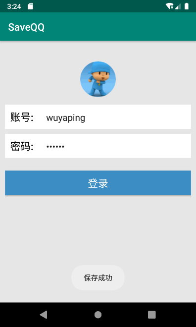
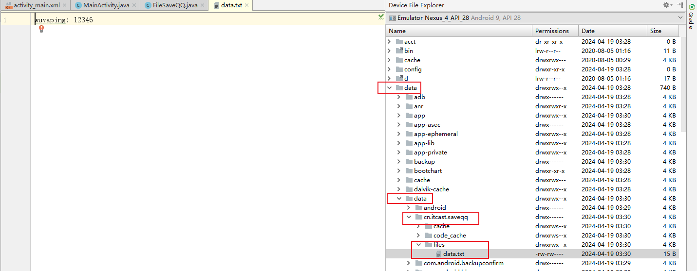
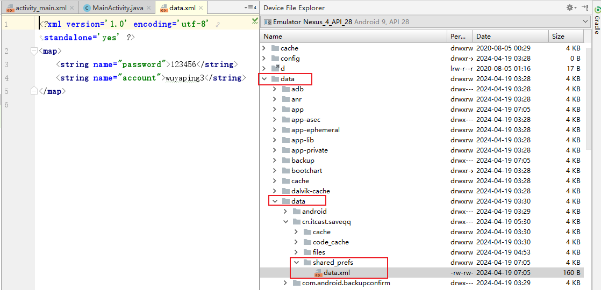
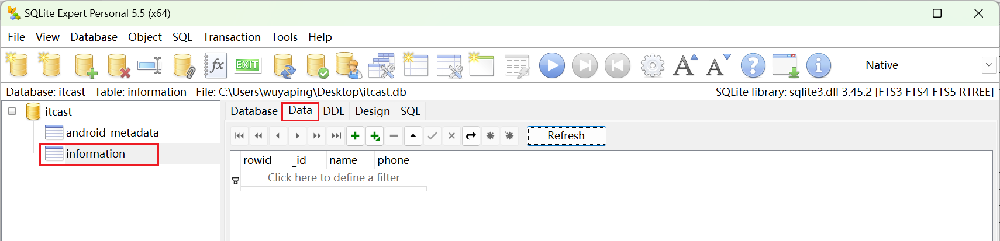
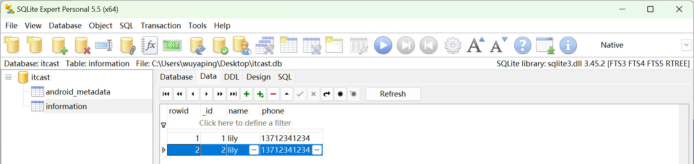

## 第5章 数据存储

## 5.2 文件存储

Android中有两种文件存储方式：内部存储和外部存储。

1. 内部存储
   - 存储位置：数据以文件的形式存储到**应用程序**中。
   - 存储路径：`data/data/<packagename>/files`
   - 访问权限：应用程序**私有**，其他应用程序想要访问需要申请权限
   - 删除文件：随应用程序卸载自动删除。
   - 操作数据：通过openFileOutput()方法和openFileInput()方法获取FileOutputStream和FileInputStream操作对象

2. 外部存储

   - 存储位置：数据以文件的形式存储到**外部设备**上（例如SD卡、内置存储卡等）。
   - 存储路径：`storage/emulated/0/`，不同厂商的存储路径可能有有所不同
   - 访问权限：可以被其他应用程序**共享**。
   - 删除文件：可连接到计算机上进行浏览、修改和删除。
   - 操作数据：直接使用FileOutputStream和FileInputStream操作对象

### 5.2.1 将数据存入文件中

1. 内部存储

   ```java
   String fileName = "data.txt";    //文件名称
   String content = "helloworld";  //保存数据
   FileOutputStream fos = null;
   try{
       // 打开应用程序中对应的输出流，将数据存储到指定的文件中。
       // 第一个参数：文件名，如果文件不存在，Android会自动创建它 第二个参数：文件的操作模式
       fos = openFileOutput(fileName, MODE_PRIVATE);  
       fos.write(content.getBytes());	// 将数据写入文件中
   }......
   ```

2. 外部存储

   ```java
   String state = Environment.getExternalStorageState();    // 获取外部设备状态
   if (state.equals(Environment.MEDIA_MOUNTED)) {   // 判断外部设备状态是否可用
       File SDPath = Environment.getExternalStorageDirectory();  // 获取SD卡目录
       File file = new File(SDPath, "data.txt");   // 创建文件对象
   
       String data = "HelloWorld";
       FileOutputStream fos = null;
       try{
           fos = new FileOutputStream(file);   // 创建文件输出流对象
           fos.write(data.getBytes());   //将数据写入文件
       }......
   }
   ```

   ==注意：使用外部存储需要申请权限，否则操作文件会失败，同时程序运行日志中会有 java.io.FileNotFoundException(Permission denied) 的警告信息。==

### 5.2.2 从文件中读取数据

1. 内部存储

   ```java
   String content = "";
   FileInputStream fis = null; 
   try{
       fis = openFileInput("data.txt");   // 打开应用程序对应的输入流，读取指定文件中的数据
       byte[] buffer = new byte[fis.available()];	  // 创建缓冲区并获取文件长度
       fis.read(buffer);     // 将文件内容读取到buffer缓冲区         	
       content = new String(buffer); // 转换成字符串
   }......
   ```

   

2. 外部存储

   ```java
   String state = Environment.getExternalStorageState();    // 获取外部设备状态
   if (state.equals(Environment.MEDIA_MOUNTED)) {   // 判断外部设备状态是否可用
   	File SDPath = Environment.getExternalStorageDirectory();  // 获取SD卡目录
       File file = new File(SDPath, "data.txt");   // 创建文件对象
   	
   	FileInputStream fis = null;
       BufferedReader br = null;   // 可以接收任意长度的数据，并避免乱码的产生
       try {
           fis = new FileInputStream(file);    // 创建文件输入流对象
           br = new BufferedReader(new InputStreamReader(fis));   //创建字符输入缓冲流的对象。InputStreamReader将字节流转成字符流
           String data = br.readLine();  // 读取数据
       }......
   } 
   ```


参考资料：

1. [Java IO——字节流和字符流详解&区别对比_javaio中字符流和字节的区别-CSDN博客](https://blog.csdn.net/u011578734/article/details/108346469)
2. [java中String和byte\[\\]转换-CSDN博客](https://blog.csdn.net/jcs1992/article/details/103413122)
3. [Java IO流（超详细！）-CSDN博客](https://blog.csdn.net/qq_44715943/article/details/116501936)

### 5.2.3 实战演练——保存QQ账号和密码

1. 创建工具类FileSaveQQ，实现QQ账号的存储与读取功能。

   （1）内部存储

   ```java
   public class FileSaveQQ {
   
       private static String FILENAME = "data.txt";
   
       public static boolean saveUserInfo(Context context, String account, String password){
           FileOutputStream fos = null;
   
           try{
               fos = context.openFileOutput(FILENAME, Context.MODE_PRIVATE);
               fos.write((account + ": " + password).getBytes());
               return true;
           }
           catch (Exception e){
               e.printStackTrace();
               return false;
           }
           finally {
               if (fos != null){
                   try {
                       fos.close();
                   } catch (IOException e) {
                       e.printStackTrace();
                   }
               }
           }
       }
   
       public static Map<String, String> getUserInfo(Context context){
           FileInputStream fis = null;
   
           try {
               fis = context.openFileInput(FILENAME);
               byte[] buffer = new byte[fis.available()];
               fis.read(buffer);
               String content = new String(buffer);
   
               Map<String, String> userMap = new HashMap<String, String>();
               String[] infos = content.split(": ");
               userMap.put("account", infos[0]);
               userMap.put("password", infos[1]);
   
               return userMap;
           } catch (Exception e) {
               e.printStackTrace();
               return null;
           } finally {
               if (fis != null){
                   try {
                       fis.close();
                   } catch (IOException e) {
                       e.printStackTrace();
                   }
               }
           }
       }
   }
   ```

   （2）外部存储

   ```java
   public class OuterFileSaveQQ {
   
       // 存储数据的文件名称
       private static String FILENAME = "data.txt";
   
       // 获取外部存储中的文件对象
       private static File getStorageFile(){
           String state = Environment.getExternalStorageState();
           if (state.equals(Environment.MEDIA_MOUNTED)){
               File SDPath = Environment.getExternalStorageDirectory();
               Log.i("saveQQ", "SDPath: " + SDPath.getPath());
               return new File(SDPath, FILENAME);
           }
           else {
               return null;
           }
       }
   
       public static boolean saveUserInfo(Context context, String account, String password){
           File file = getStorageFile();
           if (file == null){
               return false;
           }
   
           FileOutputStream fos = null;
           try {
               fos = new FileOutputStream(file);
               fos.write((account + ": " + password).getBytes());
               return true;
           } catch (Exception e) {
               e.printStackTrace();
               return false;
           }
           finally {
               if(fos != null){
                   try {
                       fos.close();
                   } catch (IOException e) {
                       e.printStackTrace();
                   }
               }
           }
       }
   
       public static Map<String, String> getUserInfo(Context context){
           FileInputStream fis = null;
           File file = getStorageFile();
           if (file == null){
               return null;
           }
   
           try {
               fis = new FileInputStream(file);
               BufferedReader br = new BufferedReader(new InputStreamReader(fis));
               String content = br.readLine();
   
               Map<String, String> userInfo = new HashMap<String, String>();
               String[] infos = content.split(": ");
               userInfo.put("account", infos[0]);
               userInfo.put("password", infos[1]);
               return userInfo;
           } catch (Exception e) {
               e.printStackTrace();
               return null;
           }
           finally {
               if (fis != null){
                   try {
                       fis.close();
                   } catch (IOException e) {
                       e.printStackTrace();
                   }
               }
           }
       }
   }
   ```

   

2. 在 MainActivity 中编写逻辑代码，实现QQ账号与密码的存储与读取功能。

   （1）使用内部存储工具类

   ```java
   public class MainActivity extends AppCompatActivity implements View.OnClickListener {
       private Button btn_login;
       private EditText et_account;
       private EditText et_password;
   
       @Override
       protected void onCreate(Bundle savedInstanceState) {
           super.onCreate(savedInstanceState);
           setContentView(R.layout.activity_main);
   
           initView();
   
           Map<String, String> userInfo = FileSaveQQ.getUserInfo(this);
           if(userInfo != null){
               et_account.setText(userInfo.get("account"));
               et_password.setText(userInfo.get("password"));
           }
       }
   
       private void initView(){
           et_account = findViewById(R.id.et_account);
           et_password = findViewById(R.id.et_password);
   
           btn_login = findViewById(R.id.btn_login);
           btn_login.setOnClickListener(this);
       }
   
       @Override
       public void onClick(View v) {
           switch (v.getId()) {
               case R.id.btn_login:
                   String account = et_account.getText().toString().trim();
                   String password = et_password.getText().toString();
                   if (TextUtils.isEmpty(account)) {
                       Toast.makeText(this, "请输入账号", Toast.LENGTH_SHORT).show();
                       return;
                   }
                   if (TextUtils.isEmpty(password)) {
                       Toast.makeText(this, "请输入密码", Toast.LENGTH_SHORT).show();
                       return;
                   }
   
                   Toast.makeText(this, "登录成功", Toast.LENGTH_SHORT).show();
                   boolean isSaveSuccess = FileSaveQQ.saveUserInfo(this, account, password);
                   if (isSaveSuccess) {
                       Toast.makeText(this, "保存成功", Toast.LENGTH_SHORT).show();
                   }
                   else{
                       Toast.makeText(this, "保存失败", Toast.LENGTH_SHORT).show();
                   }
                   break;
           }
       }
   }
   ```

   （2）使用外部存储工具类

   1. 申请SD卡写权限

      1. 在AndroidManifest.xml的<manifest>标签中申请所需权限。

         ```xml
         <uses-permission android:name="android.permission.WRITE_EXTERNAL_STORAGE"/>
         ```

      2. 在MainActivity的onCreate()方法中申请权限。

         ```java
         ActivityCompat.requestPermissions(MainActivity.this, 
                         new String[]{"android.permission.WRITE_EXTERNAL_STORAGE"}, 1);
         ```

         

   2. 修改MainActivity中使用的工具类

   ```java
   Map<String, String> userInfo = OuterFileSaveQQ.getUserInfo(this);
   
   boolean isSaveSuccess = OuterFileSaveQQ.saveUserInfo(this, account, password);
   ```

   

3. 运行程序。

   输入账号（姓名拼音）和密码（学号），点击登录，出现“保存成功”的提示。

   

   验证账号和密码是否成功保存到文件中。

   

   

## 5.3 SharedPreferences存储

文件存储位置：`/data/data/<packagename>/shared_prefs/`

### 5.3.1 将数据存入SharedPreferences

```java
// 获取 SharedPreferences 实例对象。第一个参数：文件名，文件类型为xml文件；第二个参数：文件操作模式。
SharedPreferences sp = getSharedPreferences("data",MODE_PRIVATE);   
// 获取编辑器
SharedPreferences.Editor editor = sp.edit();   
// 使用putXXX()方法存入数据。Editor对象以键值对保存数据。
editor.putString("name", "张三");                             
editor.putInt("age", 8);     
// 提交数据
editor.commit(); 
```


### 5.3.2 读取与删除SharedPreferences中的数据

1. 读取数据

   ```java
   // 获取 SharedPreferences 实例对象。
   SharedPreferences sp = getSharedPreferences("data",MODE_PRIVATE);
   // 使用getXXX()方法根据键值获取数据。第二个参数为缺省值。
   String data = sp.getString("name","");    
   ```

   

2. 删除数据

   ```java
   // 删除key值为name的数据
   editor.remove("name");   
   // 删除所有数据
   editor.clear();  
   ```


### 5.3.3 实战演练——保存QQ账号和密码

1. 创建工具类SPSaveQQ。

   ```java
   public class SPSaveQQ {
       private static final String FILENAME = "data";
       private static final String ACCOUNT = "account";
       private static final String PASSWORD = "password";
   
       public static boolean saveUserInfo(Context context, String account, String password){
           SharedPreferences sp = context.getSharedPreferences(FILENAME, Context.MODE_PRIVATE);
           SharedPreferences.Editor editor = sp.edit();
           editor.putString(ACCOUNT, account);
           editor.putString(PASSWORD, password);
           editor.commit();
           return true;
       }
   
       public static Map<String, String> getUserInfo(Context context){
           Map<String, String> userInfo = new HashMap<String, String>();
           SharedPreferences sp = context.getSharedPreferences(FILENAME, Context.MODE_PRIVATE);
           userInfo.put(ACCOUNT, sp.getString(ACCOUNT, null));
           userInfo.put(PASSWORD, sp.getString(PASSWORD, null));
           return userInfo;
       }
   }
   ```

   

2. 编写界面交互代码

   修改MainActivity中使用的工具类。

   ```java
   Map<String, String> userInfo = SPSaveQQ.getUserInfo(this);
   
   boolean isSaveSuccess = SPSaveQQ.saveUserInfo(this, account, password);
   ```

3. 运行程序。

   输入账号和密码登录成功后，验证数据是否保存到文件中。

   

##  5.4 SQLite存储

下载并安装 SQLite Expert Personal 可视化工具。下载地址：https://www.sqliteexpert.com/download.html。

以“实战演练——绿豆通讯录”为例。

参考资料：

1. [Android ：这是一份详细 & 全面的 SQLlite数据库 使用手册 - 掘金 (juejin.cn)](https://juejin.cn/post/6844903550565220366)
2. [SQLite Android SQLite：Update语句|极客笔记 (deepinout.com)](https://deepinout.com/sqlite/sqlite-questions/173_sqlite_android_sqlite_update_statement.html#:~:text=更新数据库的返回值 当我们调用 update 方法时，它会返回一个整数值，表示更新的行数。 我们可以使用这个返回值来检查是否成功更新了数据。 public int updateData(int,db %3D this.getWritableDatabase()%3B ContentValues values %3D new ContentValues()%3B)

### 5.4.1 创建 SQLite 数据库

1. 创建数据库子类（继承 SQLiteOpenHelper 类）

   ```java
   /**
    * 创建数据库子类，继承自SQLiteOpenHelper类
    * 需 复写 onCreate（）、onUpgrade（）
    */
   public class MyHelper extends SQLiteOpenHelper {
       /**
        * 构造函数
        * 在SQLiteOpenHelper的子类中，必须有该构造函数
        */
       public MyHelper(Context context) {
           // 参数说明
           // context：上下文对象
           // name：数据库名称
           // param：一个可选的游标工厂（通常是 Null）
           // version：当前数据库的版本，值必须是整数并且是递增的状态
   
           // 必须通过super调用父类的构造函数
           super(context, "itcast.db", null, 1);
       }
   
       /**
        * 复写onCreate（）
        * 调用时刻：当数据库第1次创建时调用
        * 作用：创建数据库 表 & 初始化数据
        * SQLite数据库创建支持的数据类型： 整型数据、字符串类型、日期类型、二进制
        */
       public void onCreate(SQLiteDatabase db) {
           // 创建数据库1张表
           // 通过execSQL（）执行SQL语句（此处创建了1个名为person的表）
           db.execSQL("CREATE TABLE information(_id INTEGER PRIMARY KEY AUTOINCREMENT, " +
                   "name VARCHAR(20), phone VARCHAR(20))");
   
           // 注：数据库实际上是没被创建 / 打开的（因该方法还没调用）
           // 直到getWritableDatabase() / getReadableDatabase() 第一次被调用时才会进行创建和打开
       }
       public void onUpgrade(SQLiteDatabase db, int oldVersion, int newVersion) {
       }
   }
   ```

2. 创建数据库：getWritableDatabase（）、getReadableDatabase（）

   ```java
   // 步骤1：创建DatabaseHelper对象
    // 注：此时还未创建数据库
    MyHelper myHelper = new MyHelper(this);
   
   // 步骤2：真正创建 / 打开数据库
    SQLiteDatabase db = myHelper.getWritableDatabase(); // 创建 or 打开 可读/写的数据库
    SQLiteDatabase db = myHelper.getReadableDatabase(); // 创建 or 打开 可读的数据库
   ```

   注：当需操作数据库时，都必须先创建数据库对象 & 创建 / 打开数据库。

   - 对于操作 = “增、删、改（更新）”，需获得 可"读 / 写"的权限：getWritableDatabase()
   - 对于操作 = “查询”，需获得 可"读 "的权限getReadableDatabase()

3. 在 SQLite Expert Personal 可视化工具中查看创建好的数据库。

   当前应用的数据库文件目录：data/data/"项目报名全路径"/databases。

   

### 5.4.2 SQLite 数据库的基本操作

#### 5.4.2.1 新增数据

```java
/** 
 * 1. 创建 & 打开数据库
 */ 
// 创建 or 打开 可读/写的数据库
db = myHelper.getWritableDatabase();


/** 
 *  2. 插入数据 = insert()
 */ 
// a. 创建ContentValues对象
ContentValues values = new ContentValues();
// b. 向该对象中插入键值对
values.put("name", name);
values.put("phone", phone);
  // 其中，key = 列名，value = 插入的值
  // 注：ContentValues内部实现 = HashMap，区别在于：ContenValues Key只能是String类型，Value可存储基本类型数据 & String类型

// c. 插入数据到数据库当中：insert()
long id = db.insert("information",null, values);
  // 参数1：要操作的表名称
  // 参数2：SQl不允许一个空列，若ContentValues是空，那么这一列被明确的指明为NULL值
  // 参数3：ContentValues对象 
// 注：也可采用SQL语句插入，但该方法没有返回值
// String insertSql = "insert into information (name, phone) values (?, ?)";
// db.execSQL(insertSql, new Object[]{name, phone});

// d. 检查sql执行结果
if (id == -1) {
    Toast.makeText(this, "添加失败！", Toast.LENGTH_SHORT).show();
}
else {
    Toast.makeText(this, "信息已添加！", Toast.LENGTH_SHORT).show();
}

db.close();
```



#### 5.4.2.2 查询数据

```java
case R.id.btn_query: //查询数据
    db = myHelper.getReadableDatabase();

    Cursor cursor = db.query("information", null, "name=?",
            new String[]{name},null, null, null);

    if (cursor.getCount() == 0){
        mTvShow.setText("");
        Toast.makeText(this, "没有查询到姓名是【"+name+"】的数据！",
                Toast.LENGTH_SHORT).show();
    } else {
        StringBuilder info = new StringBuilder();
        while (cursor.moveToNext()){
            info.append("ID: " + cursor.getString(0) +
                    "; Name: " + cursor.getString(1) +
                    "; Phone: " + cursor.getString(2) + "\n");
        }
        mTvShow.setText(info);
    }
    cursor.close();
    db.close();
    break;
```

相关资料：

1. [Java StringBuffer 和 StringBuilder 类 | 菜鸟教程 (runoob.com)](https://www.runoob.com/java/java-stringbuffer.html)

#### 5.4.2.3 修改数据

```java
case R.id.btn_update: //修改数据
    db = myHelper.getWritableDatabase();
    values = new ContentValues();
    values.put("phone", phone);
    int number = db.update("information", values, "name =?",
            new String[]{name});
    if (number > 0) {
        Toast.makeText(this, "成功更新"+number+"条数据！",
                Toast.LENGTH_SHORT).show();
    } else {
        Toast.makeText(this, "更新数据失败！",
                Toast.LENGTH_SHORT).show();
    }
    db.close();
    break;
```

#### 5.4.2.4 删除数据

```java
case R.id.btn_delete: //删除数据
    db = myHelper.getWritableDatabase();
    number = db.delete("information", "name=?",
            new String[]{name});
    if (number > 0) {
        Toast.makeText(this, "成功删除"+number+"条数据！",
                Toast.LENGTH_SHORT).show();
    } else {
        Toast.makeText(this, "删除失败！",
                Toast.LENGTH_SHORT).show();
    }
    db.close();
    break;
```

